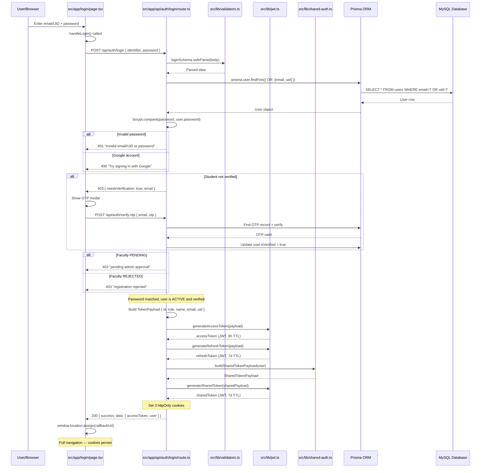

# TCET CoE Portal — Complete Authentication System

> **Audience**: New developers joining the project. Assumes basic programming knowledge.
> **Purpose**: Reverse-engineered walkthrough of the actual authentication implementation.
> **Based on**: Code in this repository only. No generic JWT tutorials.

---

## Table of Contents

1. [High-Level Authentication Architecture](#1-high-level-authentication-architecture)
2. [Registration Flow](#2-registration-flow)
3. [Login Flow](#3-login-flow)
4. [Shared Cookie Authentication](#4-shared-cookie-authentication)
5. [JWT Implementation](#5-jwt-implementation)
6. [Cookie Management](#6-cookie-management)
7. [Protected API Flow](#7-protected-api-flow)
8. [Role-Based Access Control (RBAC)](#8-role-based-access-control-rbac)
9. [Google Sign-In](#9-google-sign-in)
10. [Logout](#10-logout)
11. [Refresh Token Flow](#11-refresh-token-flow)
12. [Authentication Utilities](#12-authentication-utilities)
13. [Sequence Diagram — Login Flow](#13-sequence-diagram--login-flow)
14. [Architecture Diagram](#14-architecture-diagram)
15. [File Walkthrough (Reading Order)](#15-file-walkthrough-reading-order)
16. [Teaching Notes](#16-teaching-notes)
17. [Final Summary](#17-final-summary)

---

## 1. High-Level Authentication Architecture

### Overall Design

This project uses a **stateless JWT-based authentication system** with three tiers of tokens:

1. **Access Token** (short-lived) — proves who you are for API calls
2. **Refresh Token** (longer-lived) — lets you get a new access token without logging in again
3. **Shared Token** (cross-domain) — lets the separate "Project Dashboard" subdomain know you're logged in

All three tokens are **stored in httpOnly cookies**, not in `localStorage` or `sessionStorage`. This is a deliberate security decision — httpOnly cookies cannot be read by JavaScript, which prevents XSS (Cross-Site Scripting) attacks from stealing tokens.

### Why This Architecture Was Chosen

| Concern | Solution |
|---------|----------|
| **Statelessness** | No database sessions to manage. JWT tokens contain all identity info. |
| **Security** | httpOnly cookies prevent token theft via XSS. |
| **Cross-subdomain SSO** | The `coe_shared_token` cookie set on `.tcetcercd.in` domain works across subdomains. |
| **Separation of concerns** | CoE portal is the identity provider; Project Dashboard is a separate app that trusts the shared token. |
| **Google OAuth** | Google handles the authentication; the app trusts Google's verified ID token. |

### Supported Authentication Methods

| Method | Supported Roles |
|--------|-----------------|
| Email/Password + OTP | STUDENT, FACULTY |
| Google Sign-In (via `@tcetmumbai.in`) | STUDENT (registration), FACULTY/ADMIN (account linking only) |
| Admin seed (dev only) | ADMIN (created via `POST /api/seed` from `ADMIN_EMAIL`/`ADMIN_PASSWORD` env vars) |

> Note: an older "dev bypass" (`dev_auth_role` cookie / query-param role override) existed in earlier versions but has been removed — `authenticate()` in `src/lib/api-helpers.ts` only accepts a Bearer header or the `accessToken` cookie.

### The Three-Application Architecture

```
┌─────────────────────────────────────────────────────┐
│                 tcetcercd.in (CoE Portal)            │
│  ┌──────────────────────────────────────────────┐   │
│  │  Next.js App Router                          │   │
│  │  - Login page (/login)                       │   │
│  │  - Auth APIs (/api/auth/*)                   │   │
│  │  - Protected APIs (/api/admin/*, etc.)       │   │
│  └──────────────────────────────────────────────┘   │
│  DB: MySQL via Prisma                                │
└─────────────────────────────────────────────────────┘
                        │
            coe_shared_token cookie
            (domain: .tcetcercd.in)
                        │
                        ▼
┌─────────────────────────────────────────────────────┐
│         project-dashboard (Separate Next.js App)     │
│  ┌──────────────────────────────────────────────┐   │
│  │  Middleware reads coe_shared_token            │   │
│  │  Verifies with COE_JWT_SECRET                 │   │
│  │  Sets x-coe-* headers → user auto-provisioned │   │
│  └──────────────────────────────────────────────┘   │
│  DB: Its own MySQL (separate schema)                 │
└─────────────────────────────────────────────────────┘
```

### Core Files

| File | Purpose |
|------|---------|
| `src/lib/jwt.ts` | JWT generation & verification (all 3 token types) |
| `src/lib/api-helpers.ts` | `authenticate()`, `authorize()`, response helpers |
| `src/lib/shared-auth.ts` | Shared cookie config & payload builder |
| `src/lib/validators.ts` | Zod schemas for all auth inputs |
| `src/lib/google-auth.ts` | Google ID token verification |
| `prisma/schema.prisma` | `User`, `Otp`, `ImpersonationSession` models |

---

## 2. Registration Flow

### 2.1 Student Registration

**Complete trace: Frontend → API → Validation → Service → Database → Response**

```
FRONTEND (src/app/login/page.tsx)
│  User fills: name, email (@tcetmumbai.in), phone, password, UID
│  UID format: "24-COMPD13-28" (startYear-BRANCHDIVrollNo-endYear)
│  Step 1: Client parses UID with parseUidForPreview() for preview
│  Step 2: User confirms → handleConfirmUidAndRegister()
│  Fetch: POST /api/auth/register/student
│  Body: { name, email, phone, password, uid }
│
▼
API ROUTE (src/app/api/auth/register/student/route.ts)
│  1. Parse body → studentRegisterSchema (Zod)
│     - Validates: name≥2 chars, email must end with @tcetmumbai.in,
│       phone≥10 digits, password≥6 chars, UID regex pattern
│  2. Block if email === ADMIN_EMAIL
│  3. Check existing: prisma.user.findUnique({ where: { email } })
│     - Returns 409 if exists
│  4. Hash password: bcrypt.hash(password, 12)
│  5. Create user:
│     prisma.user.create({
│       data: {
│         name, email: email.toLowerCase(), phone,
│         password: hashedPassword,
│         role: 'STUDENT',
│         uid,
│         isVerified: false,
│         status: 'ACTIVE',    // Student is ACTIVE but UNVERIFIED
│       }
│     })
│  6. Generate OTP: Math.floor(100000 + Math.random() * 900000).toString()
│  7. Delete old OTPs: prisma.otp.deleteMany({ where: { email } })
│  8. Save OTP: prisma.otp.create({ data: { email, code: otp } })
│  9. Send email: sendOTPEmail(email, otp) via Nodemailer
│  10. Log activity via logActivity()
│
▼
RESPONSE
│  Status: 201
│  { success: true, message: "Registration successful. OTP sent to your email." }
│
▼
FRONTEND
│  Sets verificationEmail state
│  Sets needsOtp = true → shows OTP input modal
```

### 2.2 Faculty Registration

**Key differences from Student:**

- **No UID** — faculty don't have student IDs
- **No OTP** — faculty are `isVerified: true` immediately
- **Status is PENDING** — must be approved by admin before they can log in
- **Admin notified** via email

```
FRONTEND (src/app/login/page.tsx)
│  Fetch: POST /api/auth/register/faculty
│  Body: { name, email, phone, password }
│
▼
API ROUTE (src/app/api/auth/register/faculty/route.ts)
│  1. Validate with facultyRegisterSchema
│  2. Hash password: bcrypt.hash(password, 12)
│  3. Create user:
│     prisma.user.create({
│       data: {
│         name, email, phone, password: hashedPassword,
│         role: 'FACULTY',
│         isVerified: true,       // No OTP needed
│         status: 'PENDING',      // Must be approved by admin
│       }
│     })
│  4. Send admin notification: sendFacultyPendingNotification(adminEmail, { name, email })
│
▼
RESPONSE
│  201: "Faculty registration submitted. Pending admin approval."
```

### 2.3 OTP Generation

**File: `src/app/api/auth/register/student/route.ts` (lines 66-72)**

```typescript
const otp = Math.floor(100000 + Math.random() * 900000).toString();
await prisma.otp.deleteMany({ where: { email } });
await prisma.otp.create({ data: { email, code: otp } });
```

**Also used in:**
- `src/app/api/auth/resend-otp/route.ts` — rate-limited (max 3 OTPs in 15 min)
- `src/app/api/auth/forgot-password/route.ts` — password reset OTP

### 2.4 OTP Verification

**File: `src/app/api/auth/verify-otp/route.ts`**

```
1. Parse body: otpVerifySchema → { email, otp }
2. Find OTP record:
   prisma.otp.findFirst({ where: { email, code: otp }, orderBy: { createdAt: 'desc' } })
3. Check 10-minute TTL:
   if (otpRecord.createdAt < Date.now() - 10 * 60 * 1000) → expired
4. Mark user verified:
   prisma.user.updateMany({ where: { email }, data: { isVerified: true } })
5. Delete used OTPs: prisma.otp.deleteMany({ where: { email } })
6. AUTO-LOGIN: Generate all 3 tokens + set cookies
   - generateAccessToken(payload) → accessToken cookie
   - generateRefreshToken(payload) → refreshToken cookie
   - generateSharedToken() → coe_shared_token cookie
7. Fire-and-forget dashboard sync for STUDENT role

Response: { success: true, data: { accessToken, user: { id, name, email, role, uid } } }
         + 3 Set-Cookie headers
```

### 2.5 Password Hashing

**File: `src/app/api/auth/register/student/route.ts` (line 43)**

```typescript
const hashedPassword = await bcrypt.hash(password, 12);
```

- Uses **bcryptjs** library
- Salt rounds: **12** (deliberately slow — makes brute-force attacks expensive)
- Password comparison uses `bcrypt.compare()`
- Google-registered users get a **64-character random hex string** (`crypto.randomBytes(32).toString('hex')`) as password (never used for login)

### 2.6 Database Tables Involved

| Table | Model | Purpose |
|-------|-------|---------|
| `users` | `User` | All user data including hashed password, role, status, googleId |
| `otps` | `Otp` | OTP codes for verification and password reset |

### 2.7 APIs Involved

| Endpoint | Method | Purpose |
|----------|--------|---------|
| `/api/auth/register/student` | POST | Student registration |
| `/api/auth/register/faculty` | POST | Faculty registration (pending approval) |
| `/api/auth/verify-otp` | POST | Verify OTP + auto-login |
| `/api/auth/resend-otp` | POST | Resend OTP (rate-limited) |

---

## 3. Login Flow

### Complete trace from clicking "Login":

```
FRONTEND (src/app/login/page.tsx, handleLogin function, line 137)
│  User enters: identifier (email OR UID), password
│  Fetch: POST /api/auth/login
│  Body: { identifier, password }
│  credentials: "include"
│
▼
API ROUTE (src/app/api/auth/login/route.ts)
│
├── 1. PARSE & VALIDATE
│    body = await req.json()
│    parsed = loginSchema.safeParse(body)
│    loginSchema: { identifier: string.min(2), password: string.min(1) }
│    If invalid → 400 "Validation failed"
│
├── 2. NORMALIZE INPUT
│    normalizedIdentifier = identifier.trim()
│    normalizedEmail = normalizedIdentifier.toLowerCase()
│    normalizedUid = normalizedIdentifier.toUpperCase()
│
├── 3. FIND USER BY EMAIL OR UID
│    user = await prisma.user.findFirst({
│      where: { OR: [{ email: normalizedEmail }, { uid: normalizedUid }] }
│    })
│    If not found → 401 "Invalid email/UID or password."
│
├── 4. PASSWORD COMPARISON
│    isMatch = await bcrypt.compare(password, user.password)
│    If !isMatch:
│      - If user has googleId → "Invalid credentials. Try signing in with Google."
│      - Otherwise → "Invalid email/UID or password."
│
├── 5. STATUS CHECKS
│    If student + !user.isVerified → 403 { needsVerification: true, email }
│      → Frontend shows OTP modal
│    If user.status === 'PENDING' → 403 "pending admin approval"
│    If user.status === 'REJECTED' → 403 "registration was rejected"
│
├── 6. BUILD JWT PAYLOAD
│    payload: TokenPayload = {
│      id: user.id,
│      role: user.role,
│      name: user.name,
│      email: user.email,
│      uid?: user.uid,
│      industryId?: user.industryId,
│    }
│
├── 7. GENERATE THREE TOKENS
│    accessToken  = generateAccessToken(payload)
│    refreshToken = generateRefreshToken(payload)
│    sharedToken  = generateSharedToken(buildSharedTokenPayload(user))
│
├── 8. SET THREE COOKIES
│    accessToken:     httpOnly, secure, sameSite=lax, maxAge=8h, path=/
│    refreshToken:    httpOnly, secure, sameSite=lax, maxAge=7d, path=/
│    coe_shared_token: httpOnly, secure, sameSite=lax, maxAge=7d, path=/,
│                     domain=.tcetcercd.in  ← CROSS-DOMAIN!
│
▼
RESPONSE (line 78)
{
  success: true,
  message: "Login successful.",
  data: {
    accessToken,
    user: { id, name, email, role, uid, industryId }
  }
}
│
▼
FRONTEND
│  trackEvent('login', { method: 'email', role })
│  window.location.assign(callbackUrl || DEFAULT_CALLBACK_URL)
│  // Full navigation → server-rendered components read cookies fresh
```

### Files responsible for every step:

| Step | File | Key Function/Line |
|------|------|-------------------|
| Form submit | `src/app/login/page.tsx` | `handleLogin()` — line 137 |
| API route | `src/app/api/auth/login/route.ts` | `POST()` — line 17 |
| Validation | `src/lib/validators.ts` | `loginSchema` — line 63 |
| DB query | Prisma runtime | `prisma.user.findFirst()` — line 30 |
| Password check | bcryptjs | `bcrypt.compare()` — line 40 |
| Token generation | `src/lib/jwt.ts` | `generateAccessToken()` — line 45 |
| Shared token | `src/lib/shared-auth.ts` | `buildSharedTokenPayload()` — line 24 |
| Cookie config | `src/lib/api-helpers.ts` | `useSecureCookies()` — line 4 |
| Response | Next.js | `NextResponse.json()` + `.cookies.set()` |

### Why Login Accepts Both Email and UID

The `identifier` field accepts either:
- `raunak@tcetmumbai.in` — matched against `user.email`
- `24-COMPD13-28` — matched against `user.uid`

This is handled by `prisma.user.findFirst({ where: { OR: [...] } })`. The normalization ensures:
- Email is lowercased (`Raunak@...` → `raunak@...`)
- UID is uppercased (`24-compd13-28` → `24-COMPD13-28`)

---

## 4. Shared Cookie Authentication

### Why a shared authentication cookie exists

This project has **two separate Next.js applications**:

1. **CoE Portal** (`tcetcercd.in`) — the main app with facility booking, content, innovation
2. **Project Dashboard** — a completely separate app with different routes, database, and UI

Users should not have to log in twice. The `coe_shared_token` cookie lets both apps share a single login session.

### What `coe_shared_token` is

```
Name:         coe_shared_token
Type:         JWT (JSON Web Token)
Secret:       JWT_ACCESS_SECRET (same secret used for access tokens!)
Payload:      SharedTokenPayload
TTL:          7 days (fixed, not configurable)
```

### Where it is generated

Every time tokens are issued (login, OTP verify, Google login, refresh), this line runs:

```typescript
const sharedToken = generateSharedToken(buildSharedTokenPayload(user));
```

**Files where this happens:**
- `src/app/api/auth/login/route.ts` (line 74)
- `src/app/api/auth/verify-otp/route.ts` (line 85)
- `src/app/api/auth/refresh/route.ts` (line 57)
- `src/app/api/auth/google/route.ts` (line 179) — in `issueLoginResponse()`
- `src/app/api/auth/register/google/route.ts` (line 145)
- `src/app/api/auth/google/link/route.ts` (line 122)

### What information it contains

**File: `src/lib/jwt.ts` (line 32)**

```typescript
export interface SharedTokenPayload {
  email: string;
  name: string;
  role: 'ADMIN' | 'FACULTY' | 'STUDENT' | 'INDUSTRY';
  status: 'ACTIVE' | 'PENDING' | 'REJECTED';
  isImpersonating?: true;       // Only during admin impersonation
  impersonation?: {
    sessionId: string;
  };
}
```

Notice: `INDUSTRY_PARTNER` is mapped to `INDUSTRY` (line 21 in `shared-auth.ts`).

### Cookie configuration

**File: `src/lib/shared-auth.ts` (line 5)**

```typescript
export const getSharedCookieOptions = () => {
  const isProd = process.env.NODE_ENV === 'production';
  return {
    httpOnly: true,
    secure: isProd,                    // HTTPS only in production
    sameSite: 'lax' as const,
    path: '/',
    domain: isProd ? '.tcetcercd.in' : '.localhost',   // ← KEY: dot prefix!
  };
};
```

The **leading dot** (`.tcetcercd.in`) is a wildcard domain cookie — it works on:
- `tcetcercd.in`
- `project-dashboard.tcetcercd.in`
- Any other subdomain

### How the Project Dashboard Uses This Cookie

**File: `project-dashboard/src/middleware.ts`**

```typescript
const token = req.cookies.get("coe_shared_token")?.value;
if (!token) {
  const loginUrl = new URL("http://tcetcercd.in/login");
  loginUrl.searchParams.set("callbackUrl", req.nextUrl.href);
  return NextResponse.redirect(loginUrl);
}

const payload = await verifyCoEToken(token);
if (!payload || payload.status !== "ACTIVE") {
  // Redirect back to login with reason=session_expired
}

// Inject user info as headers for downstream handlers
const requestHeaders = new Headers(req.headers);
requestHeaders.set("x-coe-email", payload.email);
requestHeaders.set("x-coe-name", stripNonLatin1(payload.name || ""));
requestHeaders.set("x-coe-role", payload.role);
requestHeaders.set("x-coe-status", payload.status);
```

**File: `project-dashboard/src/lib/coe-auth.ts`**

```typescript
export async function verifyCoEToken(token: string | null | undefined) {
  const secret = process.env.COE_JWT_SECRET;
  const secretKey = new TextEncoder().encode(secret);
  const { payload } = await jwtVerify(token, secretKey);
  // Returns { email, name, role, status } or null
}
```

Important: The dashboard uses a **different library** (`jose`) and a **matching secret** (`COE_JWT_SECRET` must equal `JWT_ACCESS_SECRET` from CoE portal).

### Authentication Flow Across Multiple Portals

```
1. User visits project-dashboard.tcetcercd.in
2. No coe_shared_token cookie → redirect to tcetcercd.in/login
3. User logs in on CoE portal → CoE portal sets coe_shared_token on .tcetcercd.in
4. User is redirected back to project-dashboard
5. Browser automatically sends coe_shared_token (domain matches!)
6. Dashboard middleware verifies token, extracts { email, name, role, status }
7. Dashboard sets x-coe-email, x-coe-role, x-coe-status headers
8. Dashboard server actions read these headers to identify the user
9. If first visit: user is auto-provisioned (created) in dashboard's DB
10. Any pending project assignments for this email are resolved
```

### User Auto-Provisioning on Dashboard

**File: `project-dashboard/src/lib/resolve-user.ts`**

The `resolveUser()` function:
1. Checks if user exists in dashboard DB by email
2. If exists → updates name/role/status if changed
3. If not exists AND status is ACTIVE → creates user in dashboard DB
4. Resolves any pending project assignments for that email
   - Converts `PendingProjectAssignment` rows → `ProjectMember` entries
   - Marks assignments as `ASSIGNED`
   - Creates in-app notifications for teachers and the student

### Why This Approach Instead of Separate Logins

| Alternative | Problem | Why Shared Token Wins |
|-------------|---------|----------------------|
| Separate login form on dashboard | User friction, two passwords | One login, zero additional UX |
| OAuth 2.0 between apps | Infrastructure complexity | Single JWT cookie, no redirect dance |
| API key / token in URL | Security nightmare | httpOnly cookie, no exposure |
| Iframe / postMessage | CORS, security, complexity | Native HTTP cookie mechanism |

### Implementation Files

| File | Purpose |
|------|---------|
| `src/lib/shared-auth.ts` | Defines cookie name, options, payload builder |
| `src/lib/jwt.ts` | `generateSharedToken()`, `SharedTokenPayload` type |
| `project-dashboard/src/lib/coe-auth.ts` | `verifyCoEToken()` verification on dashboard |
| `project-dashboard/src/middleware.ts` | Reads cookie, verifies, injects headers |
| `project-dashboard/src/lib/resolve-user.ts` | Auto-provisions users + resolves pending assignments |
| `project-dashboard/src/app/api/internal/users/upsert/route.ts` | Internal sync endpoint called by CoE portal |
| `src/lib/dashboard-sync.ts` | CoE portal's sync caller (fire-and-forget) |

---

## 5. JWT Implementation

### Token Types

| Token | Secret | TTL (default) | Purpose |
|-------|--------|---------------|---------|
| **Access Token** | `JWT_ACCESS_SECRET` | 8 hours (28,800s) | Authenticates API requests |
| **Refresh Token** | `JWT_REFRESH_SECRET` | 7 days (604,800s) | Gets new access token when expired |
| **Shared Token** | `JWT_ACCESS_SECRET` | 7 days (604,800s) | Cross-subdomain SSO |

### Exact Implementation

**File: `src/lib/jwt.ts`**

```typescript
import jwt from 'jsonwebtoken';

const ACCESS_SECRET = process.env.JWT_ACCESS_SECRET || 'access-secret-change-me';
const REFRESH_SECRET = process.env.JWT_REFRESH_SECRET || 'refresh-secret-change-me';

const parsePositiveInt = (value: string | undefined, fallback: number): number => {
  if (!value) return fallback;
  const parsed = Number(value);
  if (!Number.isFinite(parsed) || parsed <= 0) return fallback;
  return Math.floor(parsed);
};

export const ACCESS_TOKEN_TTL_SECONDS = parsePositiveInt(
  process.env.JWT_ACCESS_TTL_SECONDS, 8 * 60 * 60  // 28,800 seconds
);
export const REFRESH_TOKEN_TTL_SECONDS = parsePositiveInt(
  process.env.JWT_REFRESH_TTL_SECONDS, 7 * 24 * 60 * 60  // 604,800 seconds
);
export const SHARED_TOKEN_TTL_SECONDS = 7 * 24 * 60 * 60;  // Fixed 7 days
```

### Payload Contents

**Access/Refresh Token Payload** (`TokenPayload`):

```typescript
{
  id: number,           // Database user ID
  role: string,         // "STUDENT" | "FACULTY" | "ADMIN" | "INDUSTRY_PARTNER"
  name: string,
  email: string,
  uid?: string,         // Optional — only for students
  industryId?: number,  // Optional — only for industry partners
  isImpersonating?: true,           // Optional — admin impersonation
  impersonation?: { sessionId: string },  // Optional
  iat: number,          // Issued at (added by jsonwebtoken library)
  exp: number,          // Expiry (added by jsonwebtoken library)
}
```

**Shared Token Payload** (`SharedTokenPayload`):

```typescript
{
  email: string;
  name: string;
  role: 'ADMIN' | 'FACULTY' | 'STUDENT' | 'INDUSTRY';
  status: 'ACTIVE' | 'PENDING' | 'REJECTED';
  isImpersonating?: true;
  impersonation?: { sessionId: string };
}
```

### Token Generation

```typescript
// Access token — signed with ACCESS_SECRET
export const generateAccessToken = (payload: TokenPayload): string => {
  return jwt.sign(payload, ACCESS_SECRET, { expiresIn: ACCESS_TOKEN_TTL_SECONDS });
};

// Refresh token — signed with REFRESH_SECRET (different secret!)
export const generateRefreshToken = (payload: TokenPayload): string => {
  return jwt.sign(payload, REFRESH_SECRET, { expiresIn: REFRESH_TOKEN_TTL_SECONDS });
};

// Shared token — signed with ACCESS_SECRET (same as access token)
export const generateSharedToken = (payload: SharedTokenPayload): string => {
  return jwt.sign(payload, ACCESS_SECRET, { expiresIn: SHARED_TOKEN_TTL_SECONDS });
};
```

### Token Verification

```typescript
// Verifies using ACCESS_SECRET → returns decoded payload or throws
export const verifyAccessToken = (token: string): TokenPayload => {
  return jwt.verify(token, ACCESS_SECRET) as TokenPayload;
};

// Verifies using REFRESH_SECRET → returns decoded payload or throws
export const verifyRefreshToken = (token: string): TokenPayload => {
  return jwt.verify(token, REFRESH_SECRET) as TokenPayload;
};
```

### Where Tokens are Verified

| Location | File | Function |
|----------|------|----------|
| API route helpers | `src/lib/api-helpers.ts` | `authenticate(req)` — line 37 |
| Refresh endpoint | `src/app/api/auth/refresh/route.ts` | `verifyRefreshToken()` — line 24 |
| Dashboard middleware | `project-dashboard/src/lib/coe-auth.ts` | `verifyCoEToken()` — line 20 |

### Why Two Different Secrets?

- `JWT_ACCESS_SECRET` signs **access tokens** and **shared tokens**
- `JWT_REFRESH_SECRET` signs **refresh tokens** only

This means: if someone steals the refresh token, they can't forge access tokens (they'd need the access secret). And the dashboard only needs the access secret to verify shared tokens — it never needs the refresh secret.

### Environment Variables

```bash
JWT_ACCESS_SECRET="change-me-access"   # Used for: accessToken, coe_shared_token
JWT_REFRESH_SECRET="change-me-refresh" # Used for: refreshToken
JWT_ACCESS_TTL_SECONDS="28800"         # Optional, default: 8 hours
JWT_REFRESH_TTL_SECONDS="604800"       # Optional, default: 7 days
COOKIE_SECURE="true"                   # Set true in production (HTTPS)
```

---

## 6. Cookie Management

### Complete Cookie Inventory

| # | Cookie Name | Type | Purpose |
|---|-------------|------|---------|
| 1 | `accessToken` | JWT | Authenticates API requests within the CoE portal |
| 2 | `refreshToken` | JWT | Gets a new access token without re-login |
| 3 | `coe_shared_token` | JWT | Cross-subdomain SSO for the Project Dashboard |
| 4 | `pending_reg` | JWT | Holds pending Google registration info (15 min TTL) |

### Cookie 1: `accessToken`

| Property | Value |
|----------|-------|
| **Purpose** | Bearer token for API requests |
| **Value** | JWT signed with `JWT_ACCESS_SECRET` |
| **Lifetime** | `JWT_ACCESS_TTL_SECONDS` (default: 8 hours / 28,800s) |
| **httpOnly** | `true` — JavaScript cannot read this |
| **secure** | `COOKIE_SECURE === 'true'` |
| **sameSite** | `lax` — sent for top-level navigations from same site |
| **domain** | Not set (defaults to current host) |
| **path** | `/` |
| **When created** | Login, OTP verify, Google login, Google register, token refresh |
| **When deleted** | Logout, cookie cleared |

### Cookie 2: `refreshToken`

| Property | Value |
|----------|-------|
| **Purpose** | Obtain new access token without re-authentication |
| **Value** | JWT signed with `JWT_REFRESH_SECRET` |
| **Lifetime** | `JWT_REFRESH_TTL_SECONDS` (default: 7 days / 604,800s) |
| **httpOnly** | `true` |
| **secure** | `COOKIE_SECURE === 'true'` |
| **sameSite** | `lax` |
| **domain** | Not set |
| **path** | `/` |
| **When created** | Login, OTP verify, Google login, Google register |
| **When deleted** | Logout |

### Cookie 3: `coe_shared_token`

| Property | Value |
|----------|-------|
| **Purpose** | Allow the Project Dashboard subdomain to verify authentication |
| **Value** | JWT signed with `JWT_ACCESS_SECRET` |
| **Lifetime** | Exactly 7 days (604,800s) — fixed, not configurable |
| **httpOnly** | `true` |
| **secure** | `process.env.NODE_ENV === 'production'` |
| **sameSite** | `lax` |
| **domain** | `.tcetcercd.in` (production) or `.localhost` (development) |
| **path** | `/` |
| **When created** | Login, OTP verify, Google login, Google register, token refresh |
| **When deleted** | Logout |

### Cookie 4: `pending_reg`

| Property | Value |
|----------|-------|
| **Purpose** | Temporarily store Google registration session |
| **Value** | JWT signed with `GOOGLE_REGISTRATION_SECRET` |
| **Lifetime** | 15 minutes (900s) |
| **httpOnly** | `true` |
| **secure** | `COOKIE_SECURE === 'true'` |
| **sameSite** | `strict` — NOT sent on cross-site requests! |
| **domain** | Not set |
| **path** | `/` |
| **When created** | During Google OAuth when user is new (needs to complete form) |
| **When deleted** | After successful Google registration, or expiry |

---

## 7. Protected API Flow

### Example: `GET /api/admin/stats`

**File: `src/app/api/admin/stats/route.ts`**

```
BROWSER
│  User navigates to admin page
│  fetch("/api/admin/stats", { credentials: "include" })
│
▼
BROWSER AUTOMATICALLY SENDS COOKIES
│  Cookie: accessToken=eyJhbGciOiJI...; refreshToken=eyJhbGci...
│
▼
API ROUTE (src/app/api/admin/stats/route.ts)
│
├── 1. AUTHENTICATE (line 8)
│    const user = authenticate(req);
│
│    FUNCTION: authenticate() in src/lib/api-helpers.ts (line 37)
│    │  // Try Authorization header first (Bearer token)
│    │  const authHeader = req.headers.get('authorization');
│    │  if (authHeader?.startsWith('Bearer ')) {
│    │    const token = authHeader.split(' ')[1];
│    │    return verifyAccessToken(token);  // Uses JWT_ACCESS_SECRET
│    │  }
│    │
│    │  // Fall back to cookie
│    │  const cookieToken = req.cookies.get('accessToken')?.value;
│    │  if (!cookieToken) return null;
│    │  return verifyAccessToken(cookieToken);
│    │
│    │  Returns: TokenPayload | null
│    │  - If token expired → jwt.verify() throws → catch → return null
│    │  - If token tampered → jwt.verify() throws → return null
│    │  - If valid → returns { id, role, name, email, uid?, industryId? }
│
├── 2. CHECK AUTH (line 9)
│    if (!user) return errorRes('Unauthorized', [], 401);
│    // Response: { success: false, message: "Unauthorized" }
│
├── 3. AUTHORIZE (line 10)
│    if (!authorize(user, 'ADMIN')) return errorRes('Forbidden', [], 403);
│
│    FUNCTION: authorize() in src/lib/api-helpers.ts (line 60)
│    │  if (roles.includes(user.role)) return true;
│    │  // Special case: INDUSTRY_PARTNER access
│    │  if (roles.includes('INDUSTRY_PARTNER') && user.industryId) return true;
│    │  return false;
│    │
│    │  user.role is "STUDENT" → not in ["ADMIN"] → return false → 403
│    │  user.role is "ADMIN" → in ["ADMIN"] → return true → continue
│
├── 4. EXECUTE (lines 12-18)
│    const [totalStudents, totalFaculty, pendingBookings, ...] = await Promise.all([
│      prisma.user.count({ where: { role: 'STUDENT' } }),
│      prisma.user.count({ where: { role: 'FACULTY' } }),
│      prisma.booking.count({ where: { status: 'PENDING' } }),
│      // ...
│    ]);
│
├── 5. RESPONSE (line 21)
│    return successRes({ totalStudents, totalFaculty, ... }, 'Stats retrieved.');
│    // Response: { success: true, data: { totalStudents: 500, totalFaculty: 30, ... } }
```

### Complete Chain

```
Browser Cookie
    ↓ (auto-sent via HTTP Cookie header)
Req.headers / req.cookies
    ↓
authenticate(req) in src/lib/api-helpers.ts
    ↓  verifyAccessToken(cookieToken)
verifyAccessToken() in src/lib/jwt.ts
    ↓  jwt.verify(token, ACCESS_SECRET)
TokenPayload { id, role, name, email }
    ↓
authorize(user, 'ADMIN') in src/lib/api-helpers.ts
    ↓  roles.includes(user.role)
Role check passes ✓
    ↓
Business logic → Prisma queries → MySQL
    ↓
NextResponse.json({ success: true, data: {...} })
```

### The Standard Response Envelope

Every API response follows this shape:

```typescript
// Success:
{ success: true, message: "Stats retrieved.", data: { ... } }

// Error:
{ success: false, message: "Unauthorized", data: null, errors: [] }
```

---

## 8. Role-Based Access Control (RBAC)

### Roles in the System

| Role | Enum Value | Who |
|------|------------|-----|
| **Student** | `STUDENT` | Regular students with `@tcetmumbai.in` email |
| **Faculty** | `FACULTY` | Teachers/staff who manage content and review applications |
| **Admin** | `ADMIN` | Super-admin who can manage everything |
| **Industry Partner** | `INDUSTRY_PARTNER` | External industry partners (limited access) |

**File: `prisma/schema.prisma` (line 10)**

```prisma
enum Role {
  ADMIN
  FACULTY
  STUDENT
  INDUSTRY_PARTNER
}
```

### Statuses Within Roles

| Status | Meaning |
|--------|---------|
| `ACTIVE` | Normal — full access |
| `PENDING` | Faculty who registered but admin hasn't approved yet |
| `REJECTED` | Faculty registration rejected |

**File: `prisma/schema.prisma` (line 29)**

```prisma
enum UserStatus {
  ACTIVE
  PENDING
  REJECTED
}
```

Important: Students get `ACTIVE` immediately but must verify email via OTP (`isVerified` flag).

### Where Role Verification Happens

**1. API-level — `authenticate()` + `authorize()` pattern**

**File: `src/lib/api-helpers.ts`**

```typescript
// Every protected route uses this pattern:
const user = authenticate(req);
if (!user) return errorRes('Unauthorized', [], 401);
if (!authorize(user, 'ADMIN')) return errorRes('Forbidden', [], 403);
```

Examples of role-gated routes:

| Route | Allowed Roles |
|-------|---------------|
| `GET /api/admin/stats` | `ADMIN` |
| `PATCH /api/admin/bookings/[id]/confirm` | `ADMIN` |
| `POST /api/news` | `FACULTY`, `ADMIN` |
| `GET /api/profile` | `STUDENT` |
| `POST /api/bookings` | `STUDENT` |

**2. Middleware-level — in project-dashboard**

**File: `project-dashboard/src/middleware.ts`**

```typescript
const requestHeaders = new Headers(req.headers);
requestHeaders.set("x-coe-email", payload.email);
requestHeaders.set("x-coe-role", payload.role);
requestHeaders.set("x-coe-status", payload.status);
```

Server actions on the dashboard read these headers and use `requireRole()` guards.

**3. Frontend-level — redirects**

**File: `src/app/login/page.tsx`** — After login, `window.location.assign()` triggers a full navigation. Server-rendered components check the cookie and redirect if unauthorized.

### How Unauthorized Access is Prevented

1. **Frontend can't bypass**: All sensitive data comes from API routes, so hiding UI isn't enough
2. **Every API route checks**: `authenticate()` + `authorize()` in the route handler itself
3. **Token integrity**: JWT is signed — users cannot modify their role in the token
4. **Status gates**: Even with a valid token, `PENDING` or `REJECTED` users are blocked

### Industry Partner Special Rule

**File: `src/lib/api-helpers.ts` (line 63)**

```typescript
// Industry membership is additive: admin/faculty can also act as industry members
if (roles.includes('INDUSTRY_PARTNER') && typeof user.industryId === 'number') {
  return true;
}
```

This means: if a route allows `INDUSTRY_PARTNER`, a user who has `industryId` set can access it even if their main role is something else (e.g., an admin who also has industry access).

### The `authorize()` Function Logic

```typescript
export const authorize = (user: TokenPayload, ...roles: string[]): boolean => {
  // Direct role match
  if (roles.includes(user.role)) return true;

  // Industry membership is additive
  if (roles.includes('INDUSTRY_PARTNER') && typeof user.industryId === 'number') {
    return true;
  }

  return false;
};
```

---

## 9. Google Sign-In

### Overview

Google Sign-In has three flows:

1. **Returning user** (has `googleId` on their account) → direct login
2. **Existing user without Google** → prompt to link account
3. **New user** → register with Google

All flows are gated by `GOOGLE_SIGNIN_ENABLED === 'true'`.

### Flow 1: Returning User (Login)

```
FRONTEND
│  User clicks "Sign in with Google" button
│  Google One Tap shows account picker
│  Google returns credential (ID token JWT)
│  Fetch: POST /api/auth/google
│  Body: { credential }
│
▼
API ROUTE (src/app/api/auth/google/route.ts)
│
├── 1. Feature flag: if !GOOGLE_SIGNIN_ENABLED → 404
├── 2. Rate limit: 30 req/min/IP (in-memory Map)
├── 3. Validate: googleAuthSchema → { credential }
├── 4. Verify Google token:
│    googlePayload = await verifyGoogleToken(credential)
│    │  Uses google-auth-library OAuth2Client
│    │  Validates: signature, audience (GOOGLE_CLIENT_ID),
│    │            issuer (accounts.google.com), expiry
│    │  Returns: { sub, email, name, email_verified }
│
├── 5. Check email_verified === true
├── 6. Check domain: email must end with @tcetmumbai.in
├── 7. Look up user by googleId:
│    const user = await prisma.user.findUnique({ where: { googleId: sub } })
│    If found → issueLoginResponse(user, sub)
│    │  Generate all 3 tokens + set cookies
│    │  Return { action: 'login', accessToken, user }
│
▼
FRONTEND
│  Receives { action: 'login' } → redirect to dashboard
```

### Flow 2: Account Linking

```
│  Step 7 (alternate): userByEmail found but no googleId
│  Return { action: 'link_prompt', email, name, role }
│
│  Edge case: userByEmail found AND it already has a googleId that did not
│  match this token's `sub` → 409 GOOGLE_ALREADY_LINKED ("already linked to
│  a different user")
│
▼
FRONTEND
│  Shows modal: "Link your Google account with existing account?"
│  User confirms → fetch POST /api/auth/google/link
│  Body: { credential }
│
▼
LINK ROUTE (src/app/api/auth/google/link/route.ts)
│
├── 1. Verify Google token again (fresh verification)
├── 2. Find user by email
├── 3. Check user status (ACTIVE only)
├── 4. Link: prisma.user.update({ where: { id }, data: { googleId: sub } })
├── 5. issueLinkLoginResponse(user, sub) → same 3 cookies
│
▼
FRONTEND
│  Redirected as logged in
```

### Flow 3: New User Registration

```
│  Step 7 (alternate): user not found by googleId or email
│  → This is a new user
│
├── 8. Generate pending_reg JWT:
│    jwt.sign({ sub, email, name }, GOOGLE_REGISTRATION_SECRET, { expiresIn: '15m' })
│
├── 9. Set pending_reg cookie:
│    response.cookies.set('pending_reg', token, {
│      httpOnly: true, secure, sameSite: 'strict', maxAge: 900, path: '/'
│    })
│
├── 10. Return { action: 'register', email, name }
│
▼
FRONTEND
│  Shows registration form: Name, UID, Phone
│  User fills form → fetch POST /api/auth/register/google
│  Body: { name, uid, phone }
│  Cookie: pending_reg is automatically sent
│
▼
GOOGLE REGISTER ROUTE (src/app/api/auth/register/google/route.ts)
│
├── 1. Rate limit: 10 req/min/IP
├── 2. Read pending_reg cookie
├── 3. Verify: jwt.verify(pendingRegToken, GOOGLE_REGISTRATION_SECRET)
├── 4. Re-verify domain (defense in depth)
├── 5. Validate form body (googleRegistrationSchema)
├── 6. Generate random password:
│    crypto.randomBytes(32).toString('hex')
│    bcrypt.hash(randomPw, 12)
│    → User can NEVER log in with email/password (no password known)
│
├── 7. PRISMA TRANSACTION (atomic):
│    - Check email unique → EMAIL_EXISTS error
│    - Check UID unique → UID_EXISTS error
│    - Check googleId unique → GOOGLE_ALREADY_LINKED error
│    - Create user: { name, email, phone, uid, password: randomHash,
│                    googleId: sub, role: 'STUDENT', isVerified: true, status: 'ACTIVE' }
│
├── 8. Clear pending_reg cookie (maxAge: 0)
├── 9. Generate all 3 tokens + set cookies
├── 10. Fire-and-forget dashboard sync
│
▼
FRONTEND
│  Redirected as logged in
```

### Google Token Verification Details

**File: `src/lib/google-auth.ts`**

```typescript
import { OAuth2Client } from 'google-auth-library';

const client = new OAuth2Client(process.env.GOOGLE_CLIENT_ID);

export async function verifyGoogleToken(credential: string): Promise<GoogleTokenPayload> {
  const ticket = await client.verifyIdToken({
    idToken: credential,
    audience: process.env.GOOGLE_CLIENT_ID,
  });

  const payload = ticket.getPayload();
  // Validates: signature, aud, iss, exp (library handles all of this)

  return {
    sub: payload.sub,          // Google's unique user ID
    email: payload.email,
    name: payload.name || payload.email.split('@')[0],
    email_verified: payload.email_verified === true,
  };
}
```

### Environment Variables for Google Auth

```bash
GOOGLE_CLIENT_ID="your-google-client-id"            # Server-side verification
NEXT_PUBLIC_GOOGLE_CLIENT_ID="same-as-above"         # Frontend provider
GOOGLE_REGISTRATION_SECRET="separate-secret"         # For pending_reg JWT
GOOGLE_SIGNIN_ENABLED="true"                         # Feature flag
ALLOWED_EMAIL_DOMAIN="tcetmumbai.in"                 # Domain restriction
```

### Security Considerations

1. **Separate secret**: `GOOGLE_REGISTRATION_SECRET` is different from `JWT_ACCESS_SECRET`
2. **Short TTL**: `pending_reg` cookie expires in 15 minutes
3. **SameSite=Strict**: `pending_reg` is not sent on cross-site requests
4. **Rate limiting**: 30 req/min for OAuth entry, 10 req/min for registration/linking
5. **Feature flag**: All Google endpoints return 404 when `GOOGLE_SIGNIN_ENABLED=false`

---

## 10. Logout

### What happens during logout

**File: `src/app/api/auth/logout/route.ts`**

```typescript
export async function POST(request: NextRequest) {
  tryCloseImpersonationSession(request);   // 1. Close any active impersonation

  const secureCookies = useSecureCookies();
  const sharedCookieOptions = getSharedCookieOptions();
  const response = NextResponse.json({
    success: true,
    message: "Logged out successfully.",
  });
  clearAuthCookies(response, secureCookies, sharedCookieOptions);  // 2. Delete all 3 cookies
  return response;
}
```

### Which cookies are removed

| Cookie | How | Effect |
|--------|-----|--------|
| `accessToken` | Set with `maxAge: 0` | Browser deletes it immediately |
| `refreshToken` | Set with `maxAge: 0` | Browser deletes it immediately |
| `coe_shared_token` | Set with `maxAge: 0` + domain `.tcetcercd.in` | Deleted for all subdomains |

### Impersonation Session Cleanup

```typescript
const tryCloseImpersonationSession = (req: NextRequest) => {
  const token = req.cookies.get("accessToken")?.value;
  if (!token) return;

  try {
    const decoded = verifyAccessToken(token);
    if (decoded.isImpersonating && decoded.impersonation?.sessionId) {
      // Close the impersonation session in the database
      prisma.impersonationSession.update({
        where: { id: sessionId },
        data: { status: "ENDED", endedAt: new Date() },
      });
    }
  } catch { /* token invalid — nothing to clean up */ }
};
```

### Logout supports both POST and GET

```typescript
// POST /api/auth/logout — for programmatic logout (fetch API)
export async function POST(request: NextRequest) { ... }

// GET /api/auth/logout?callbackUrl=... — for link-based logout
export async function GET(request: NextRequest) {
  // Clears cookies AND redirects to callbackUrl
  const response = NextResponse.redirect(resolvedCallbackUrl);
  clearAuthCookies(response, secureCookies, sharedCookieOptions);
  return response;
}
```

### How sessions become invalid

The system uses **stateless JWT**, so there is no server-side session to invalidate. The tokens:

1. Are deleted from the browser → subsequent requests have no credentials
2. Will eventually expire on their own (8h for access, 7d for refresh)

This means: if an attacker captured the cookie before logout, they could still use it until expiry. This is a known trade-off with stateless JWT. In practice, the httpOnly flag and short access token lifetime mitigate this.

---

## 11. Refresh Token Flow

### Complete trace:

```
BROWSER
│  API request returns 401 (accessToken expired)
│  Fetch: POST /api/auth/refresh
│  Cookie: refreshToken=<token> (sent automatically)
│
▼
API ROUTE (src/app/api/auth/refresh/route.ts)
│
├── 1. READ REFRESH TOKEN
│    const refreshToken = req.cookies.get('refreshToken')?.value;
│    If missing → 401 "No refresh token provided."
│
├── 2. VERIFY REFRESH TOKEN
│    const decoded = verifyRefreshToken(refreshToken) as TokenPayload;
│    │  jwt.verify(token, REFRESH_SECRET) → throws if expired/tampered
│    │  If throws → catch → 401 "Invalid or expired refresh token."
│
├── 3. CHECK IMPERSONATION
│    if (decoded.isImpersonating) → handleImpersonationRefresh(decoded)
│    │  Separate flow that checks ImpersonationSession in DB
│    │  If session expired → falls back to admin's identity
│
├── 4. FETCH CURRENT USER (NORMAL FLOW)
│    const currentUser = await prisma.user.findUnique({
│      where: { id: decoded.id },
│      select: { id, role, name, email, uid, industryId, status }
│    });
│    If user not found → 401
│
├── 5. GENERATE NEW TOKENS
│    const payload: TokenPayload = { id, role, name, email, ... }
│    const accessToken = generateAccessToken(payload);
│    const sharedToken = generateSharedToken(buildSharedTokenPayload(currentUser));
│    Note: refreshToken is NOT regenerated (no rotation in normal flow)
│
├── 6. SET UPDATED COOKIES
│    response.cookies.set('accessToken', newAccessToken, { maxAge: 8h })
│    response.cookies.set('coe_shared_token', newSharedToken, { maxAge: 7d })
│    (refreshToken cookie stays unchanged)
│
▼
RESPONSE
│  { success: true, data: { accessToken }, message: "Token refreshed successfully." }
```

### Design Decisions

| Decision | Why |
|----------|-----|
| **No refresh token rotation** | Simpler implementation. If someone steals the refresh token, they have 7 days access. Mitigated by httpOnly. |
| **Refresh token rotated during impersonation** | Impersonation is higher-risk; rotation ensures admin gets back their own identity cleanly |
| **DB fetch on every refresh** | Ensures user still exists and is active. If admin deactivated the user, refresh fails. |
| **Shared token refreshed too** | Keeps cross-domain SSO alive without requiring re-login on dashboard |

### Impersonation Refresh Flow

When an admin impersonates a user:

```typescript
async function handleImpersonationRefresh(decoded: TokenPayload) {
  // 1. Look up the ImpersonationSession in DB
  const session = await prisma.impersonationSession.findUnique({
    where: { id: decoded.impersonation?.sessionId },
  });

  // 2. If session is not ACTIVE → fall back to admin's identity
  if (!session || session.status !== 'ACTIVE') {
    return impersonationFallback(session.adminId, ...);
  }

  // 3. Verify both admin and target user are still ACTIVE
  const [admin, target] = await Promise.all([
    prisma.user.findUnique({ where: { id: session.adminId } }),
    prisma.user.findUnique({ where: { id: session.targetUserId } }),
  ]);

  // 4. Generate tokens for the TARGET user's identity
  const impersonationPayload = buildImpersonationAccessTokenPayload(target, sessionId);
  const accessToken = generateAccessToken(impersonationPayload);
  const newRefreshToken = generateRefreshToken(impersonationPayload);  // ← ROTATED!
  const sharedToken = generateSharedToken(buildSharedTokenPayload(target, { sessionId }));
  // Set all 3 cookies
}
```

---

## 12. Authentication Utilities

### 12.1 API Helpers

**File: `src/lib/api-helpers.ts`**

| Function | Purpose |
|----------|---------|
| `useSecureCookies()` | Returns `COOKIE_SECURE === 'true'` — controls whether cookies use `Secure` flag |
| `successRes(data, msg, status)` | Standard success response wrapper `{ success: true, message, data }` |
| `errorRes(msg, errors, status)` | Standard error response wrapper `{ success: false, message, data: null, errors }` |
| `authenticate(req)` | Extracts and verifies JWT from Bearer header or accessToken cookie |
| `authorize(user, ...roles)` | Checks if user's role is in the allowed roles list |

### 12.2 JWT Utilities

**File: `src/lib/jwt.ts`**

| Function | Purpose |
|----------|---------|
| `generateAccessToken(payload)` | Creates JWT with `JWT_ACCESS_SECRET`, TTL=8h |
| `generateRefreshToken(payload)` | Creates JWT with `JWT_REFRESH_SECRET`, TTL=7d |
| `generateSharedToken(payload)` | Creates JWT with `JWT_ACCESS_SECRET`, TTL=7d |
| `verifyAccessToken(token)` | Verifies and decodes access/shared token |
| `verifyRefreshToken(token)` | Verifies and decodes refresh token |
| `buildImpersonationAccessTokenPayload(target, sessionId)` | Builds impersonation token payload |

### 12.3 Shared Auth Utilities

**File: `src/lib/shared-auth.ts`**

| Function/Variable | Purpose |
|-------------------|---------|
| `SHARED_COOKIE_NAME` | `'coe_shared_token'` |
| `getSharedCookieOptions()` | Returns cookie config with cross-domain settings |
| `buildSharedTokenPayload(user)` | Maps user data to `SharedTokenPayload` (includes role mapping) |

### 12.4 Google Auth

**File: `src/lib/google-auth.ts`**

| Function | Purpose |
|----------|---------|
| `verifyGoogleToken(credential)` | Verifies Google ID token, returns `{ sub, email, name, email_verified }` |

### 12.5 Dashboard Sync

**File: `src/lib/dashboard-sync.ts`**

| Function | Purpose |
|----------|---------|
| `syncDashboardUser(user)` | Fire-and-forget: sends user to Project Dashboard's internal API |
| `syncFaculty(userId)` | Syncs faculty user including profile data |

### 12.6 Cookie Management (embedded in routes)

Cookie management is done inline in route handlers using:

```typescript
response.cookies.set('name', value, { httpOnly, secure, sameSite, maxAge, path })
response.cookies.set('name', '', { maxAge: 0 })  // Delete
```

There is no separate `cookies.ts` utility file — it's all inline.

### 12.7 Validators

**File: `src/lib/validators.ts`**

| Schema | Fields | Purpose |
|--------|--------|---------|
| `studentRegisterSchema` | name, email(@tcetmumbai.in), phone, password(≥6), UID | Student registration |
| `facultyRegisterSchema` | name, email(@tcetmumbai.in), phone, password | Faculty registration |
| `loginSchema` | identifier (email or UID), password | Login |
| `otpVerifySchema` | email, otp (exactly 6 digits) | OTP verification |
| `resendOtpSchema` | email | Resend OTP |
| `forgotPasswordSchema` | email | Password reset request |
| `resetPasswordSchema` | email, otp, newPassword | Password reset execution |
| `googleAuthSchema` | credential | Google auth entry |
| `googleRegistrationSchema` | name, UID, phone | Google registration completion |

### 12.8 Callback URL Validation

**File: `src/lib/callback-url.ts`**

```typescript
export const DEFAULT_CALLBACK_URL = 'https://tcetcercd.in';

export const isValidCallbackUrl = (url: string): boolean => {
  try {
    const parsed = new URL(url);
    if (!['http:', 'https:'].includes(parsed.protocol)) return false;
    const hostname = parsed.hostname.toLowerCase();
    return hostname === 'tcetcercd.in' || hostname.endsWith('.tcetcercd.in');
  } catch {
    return false;
  }
};
```

This prevents **open redirect attacks** — an attacker could otherwise craft a login URL that redirects to their malicious site after login. Only `tcetcercd.in` and its subdomains are allowed.

### 12.9 Data Models (Prisma)

**File: `prisma/schema.prisma`**

**User model** (line 149):
```prisma
model User {
  id         Int        @id @default(autoincrement())
  name       String
  email      String     @unique
  phone      String?
  password   String
  role       Role
  uid        String?
  googleId   String?    @unique
  isVerified Boolean    @default(false)
  status     UserStatus @default(ACTIVE)
  createdAt  DateTime   @default(now())
  updatedAt  DateTime   @updatedAt
  industryId Int?
  industry   Industry?  @relation(...)
  // ... business relations (bookings, news, etc.)
}
```

**Otp model** (line 666):
```prisma
model Otp {
  id        Int      @id @default(autoincrement())
  email     String
  code      String
  createdAt DateTime @default(now())
}
```

**ImpersonationSession model** (line 799):
```prisma
model ImpersonationSession {
  id              String              @id @default(uuid())
  adminId         Int
  targetUserId    Int
  status          ImpersonationStatus @default(ACTIVE)
  startedAt       DateTime            @default(now())
  endedAt         DateTime?
  durationSeconds Int?
  ipAddress       String?
  userAgent       String?
  metadata        Json?
}
```

---

## 13. Sequence Diagram — Complete Login Flow



---

## 14. Architecture Diagram

```mermaid
graph TB
    subgraph "Browser"
        B[Browser]
        C1[accessToken cookie]
        C2[refreshToken cookie]
        C3[coe_shared_token cookie]
    end

    subgraph "CoE Portal (tcetcercd.in)"
        subgraph "Frontend"
            LP[src/app/login/page.tsx<br/>Login/Register UI]
            GA[Google Sign-In Button<br/>@react-oauth/google]
        end

        subgraph "API Layer"
            LG[POST /api/auth/login]
            RG[POST /api/auth/register/*]
            VO[POST /api/auth/verify-otp]
            RF[POST /api/auth/refresh]
            LO[POST /api/auth/logout]
            GO[POST /api/auth/google]
            GL[POST /api/auth/google/link]
            GR[POST /api/auth/register/google]
            FP[POST /api/auth/forgot-password]
            RP[POST /api/auth/reset-password]
            PROTECTED[Protected API routes<br/>/api/admin/* /api/bookings/* etc.]
        end

        subgraph "Authentication Layer"
            AUTH[src/lib/api-helpers.ts<br/>authenticate() + authorize()]
            JWT[src/lib/jwt.ts<br/>generate/verify tokens]
            SHARED[src/lib/shared-auth.ts<br/>Shared cookie config]
            GOOGLE[src/lib/google-auth.ts<br/>Verify Google ID token]
            VALIDATORS[src/lib/validators.ts<br/>Zod schemas]
            MAILER[src/lib/mailer.ts<br/>Send OTP emails]
            SYNC[src/lib/dashboard-sync.ts<br/>Fire-and-forget user sync]
        end

        subgraph "Data Layer"
            PRISMA[Prisma ORM]
            DB[(MySQL Database)]
            MODELS[User, Otp, Booking, ...]
        end
    end

    subgraph "Project Dashboard (project-dashboard.tcetcercd.in)"
        MW[project-dashboard/src/middleware.ts<br/>coe_shared_token verification]
        COEAUTH[project-dashboard/src/lib/coe-auth.ts<br/>verifyCoEToken()]
        RESOLVE[project-dashboard/src/lib/resolve-user.ts<br/>Auto-provision + resolve assignments]
        DASHAPI[Protected dashboard APIs]
    end

    subgraph "External Services"
        GOOGLE_OAUTH[Google OAuth 2.0<br/>accounts.google.com]
        SMTP[Nodemailer / SMTP<br/>Email delivery]
    end

    B --> LP
    B --> GA
    B --> C1
    B --> C2
    B --> C3

    LP --> LG
    LP --> RG
    LP --> VO
    GA --> GO

    LG --> VALIDATORS
    LG --> PRISMA
    LG --> JWT
    LG --> SHARED

    VO --> JWT
    VO --> SHARED

    GO --> GOOGLE
    GO --> JWT
    GO --> SHARED
    GO --> PRISMA

    RF --> JWT
    RF --> SHARED
    RF --> PRISMA

    LO --> JWT

    PROTECTED --> AUTH
    AUTH --> JWT

    JWT --> C1
    JWT --> C2
    SHARED --> C3

    PRISMA --> DB
    PRISMA --> MODELS

    SYNC --> DASHAPI

    GOOGLE --> GOOGLE_OAUTH
    MAILER --> SMTP

    C3 -.->|Domain: .tcetcercd.in| MW
    MW --> COEAUTH
    COEAUTH --> RESOLVE
```

---

## 15. File Walkthrough (Reading Order)

New developers should read the files in this exact order.

### Phase 1: Foundation (~30 min)

| # | File | Why Read First |
|---|------|----------------|
| 1 | `prisma/schema.prisma` (lines 149-195, 627-635) | Understand the data model: User table has all auth fields (password, role, status, googleId, isVerified). No Session table — sessions are JWT-based. |
| 2 | `src/lib/jwt.ts` | The core of the entire auth system. Understand `TokenPayload`, `SharedTokenPayload`, the three `generate*` functions, and the two `verify*` functions. |
| 3 | `src/lib/api-helpers.ts` | The two most important functions: `authenticate()` (extracts+verifies JWT) and `authorize()` (checks role). Every protected route uses these. |

**What you should understand after Phase 1:**
- How JWT tokens are created and verified
- What information is stored in each token type
- The `authenticate()` + `authorize()` pattern

### Phase 2: Login Flow (~30 min)

| # | File | Why |
|---|------|-----|
| 4 | `src/lib/validators.ts` (lines 63-97) | The Zod schemas for all auth inputs. Understand what validation happens on the server. |
| 5 | `src/app/api/auth/login/route.ts` | The complete login flow end-to-end. See how identifier (email/UID) is looked up, bcrypt comparison, status checks, and triple-cookie creation. |
| 6 | `src/app/login/page.tsx` | The login/register UI. Understand how `handleLogin`, `handleRegister`, and `verifyOtp` call the APIs, and the state machine (login vs OTP vs register). |

**What you should understand after Phase 2:**
- How a user logs in from click to redirect
- How the login page manages state (login/OTP/register modes)
- What happens when password is wrong / account is pending / needs OTP

### Phase 3: Registration + OTP (~30 min)

| # | File | Why |
|---|------|-----|
| 7 | `src/app/api/auth/register/student/route.ts` | Student registration: bcrypt hash, user creation, OTP generation/save/email. |
| 8 | `src/app/api/auth/register/faculty/route.ts` | Faculty registration: simpler (no OTP), but status is PENDING. Admin notification. |
| 9 | `src/app/api/auth/verify-otp/route.ts` | OTP verification + auto-login. Notice how it generates the same 3 cookies as login. Also triggers dashboard sync. |
| 10 | `src/app/api/auth/resend-otp/route.ts` | Rate-limited OTP resend (max 3 in 15 min). |

**What you should understand after Phase 3:**
- The difference between student and faculty registration
- How OTP works (generation, storage, 10-min TTL, deletion)
- OTP verify auto-logs in with full token generation

### Phase 4: Session Management (~20 min)

| # | File | Why |
|---|------|-----|
| 11 | `src/app/api/auth/refresh/route.ts` | Token refresh logic. Understand: no rotation, DB fetch checks user still exists, impersonation special handling. |
| 12 | `src/app/api/auth/logout/route.ts` | Cookie clearing logic. Also handles impersonation session cleanup. |

**What you should understand after Phase 4:**
- How the refresh token extends the session without re-login
- Why refresh token is NOT rotated (and why it IS during impersonation)
- What happens during logout (cookies deleted, impersonation closed)

### Phase 5: Cross-Domain SSO (~30 min)

| # | File | Why |
|---|------|-----|
| 13 | `src/lib/shared-auth.ts` | Defines `coe_shared_token` cookie name, domain options, and payload builder. The role mapping (INDUSTRY_PARTNER → INDUSTRY) happens here. |
| 14 | `project-dashboard/src/lib/coe-auth.ts` | How the dashboard verifies the shared token. Uses `jose` library (not `jsonwebtoken`). |
| 15 | `project-dashboard/src/middleware.ts` | Dashboard middleware: reads `coe_shared_token`, verifies, injects `x-coe-*` headers. Redirects to CoE login if missing. |
| 16 | `project-dashboard/src/lib/resolve-user.ts` | How dashboard auto-provisions users on first visit and resolves pending project assignments. |
| 17 | `src/lib/dashboard-sync.ts` | How CoE portal notifies dashboard about new users (fire-and-forget after OTP verify and Google registration). |

**What you should understand after Phase 5:**
- How two separate applications share authentication
- The cookie domain mechanism (`.tcetcercd.in`)
- How users are auto-provisioned on the dashboard
- How pending project assignments are resolved on first login

### Phase 6: Google Sign-In (~30 min)

| # | File | Why |
|---|------|-----|
| 18 | `src/lib/google-auth.ts` | Google ID token verification using `google-auth-library`. |
| 19 | `src/app/api/auth/google/route.ts` | The OAuth entry point with all three flows (login, link_prompt, register). Rate limiting, domain check, feature flag. |
| 20 | `src/app/api/auth/google/link/route.ts` | Account linking: updates user's googleId field. |
| 21 | `src/app/api/auth/register/google/route.ts` | Google registration: `pending_reg` cookie, random password, atomic Prisma transaction. |

**What you should understand after Phase 6:**
- The three Google flows (login / link / register)
- How `pending_reg` cookie bridges the gap between Google auth and form completion
- Why Google users get a random password
- The atomic Prisma transaction that prevents race conditions

### Phase 7: Putting It Together (~20 min)

| # | File | Why |
|---|------|-----|
| 22 | `src/app/api/admin/stats/route.ts` | The simplest protected route. Shows the `authenticate()` + `authorize()` pattern in action. |
| 23 | `src/lib/callback-url.ts` | Ensures redirect URLs only go to trusted domains (prevents open redirect attacks). |
| 24 | `src/app/api/auth/forgot-password/route.ts` | Password reset flow: OTP sent, same 10-min TTL, non-enumerating response. |
| 25 | `src/app/api/auth/reset-password/route.ts` | Actually updates the password in DB after OTP verification. |

**What you should understand after Phase 7:**
- How to add a new protected route (the pattern to follow)
- How password reset works (OTP-based, same as email verification)
- The complete auth picture end-to-end

### Total Reading Time: ~3 hours

---

## 16. Teaching Notes

### Section 1: Why httpOnly Cookies?

**Why this exists**: If a hacker runs JavaScript on your page (XSS attack), they can read `localStorage` and steal tokens. httpOnly cookies are invisible to JavaScript — the browser sends them automatically, but no script can read them.

**Common beginner mistake**: Storing JWT in `localStorage` and reading it with `Authorization: Bearer` header from JavaScript. This project supports both patterns (Bearer header AND cookie), but the cookie pattern is more secure.

**Simple analogy**: An httpOnly cookie is like a keycard that stays in your pocket. Your body (the browser) automatically presents it at the door. localStorage is like pinning the keycard to your shirt — anyone can read it.

### Section 2: Why bcrypt, not just hash?

**Why this exists**: Password hashing is deliberately slow. `bcrypt.hash(password, 12)` takes about 250ms. This makes it prohibitively expensive for attackers to try thousands of passwords per second.

**Common beginner mistake**: Using `md5` or `sha256` for passwords — these are designed to be FAST, which is the opposite of what you want for passwords.

**Simple analogy**: It's like a bank vault door that takes 30 seconds to open. Annoying for customers? Yes. But it means a robber can't try 10,000 keys per second.

### Section 3: Why Three Separate Tokens?

**Why this exists**:
- **Access token** (8h): Short-lived so if stolen, damage is limited
- **Refresh token** (7d): Longer-lived so user doesn't re-login daily, but only used once per 8 hours
- **Shared token** (7d): Separate from the other two so the dashboard doesn't need the refresh secret

**Common confusion**: "Why is the refresh token not rotated?" — In some systems, every refresh invalidates the old refresh token. This project chose simplicity: the refresh token stays valid for 7 days regardless of how many times it's used.

### Section 4: Why .tcetcercd.in Domain Cookie?

**Why this exists**: Cookies are normally scoped to one domain. `app.tcetcercd.in` cookies don't reach `dashboard.tcetcercd.in`. But when you set `domain: .tcetcercd.in`, the cookie works on ALL subdomains.

**Common misunderstanding**: The dot prefix (`.tcetcercd.in`) is the standard way to make a cookie available to all subdomains. Without the dot, it's scoped to the exact domain.

**Simple analogy**: It's like a universal badge that works at every building on campus, instead of a badge that only works at one specific building.

### Section 5: Why Google Gets a Random Password?

**Why this exists**: The `password` field is `NOT NULL` in the database. Google-authenticated users never use a password, but the field can't be empty. So they get a secure random 64-character hex string. Since the app never tells the user this password, they can only log in via Google.

**Beginner mistake**: Wondering "can a Google user log in with email/password?" — No, because nobody knows the 64-character hex password.

### Section 6: The Difference Between `isVerified` and `status`

**What confuses new developers**:
- `isVerified` = Email verified via OTP (boolean)
- `status` = Account approval status (`ACTIVE` | `PENDING` | `REJECTED`)

For students: `status=ACTIVE` but `isVerified=false` after registration → must verify email via OTP.

For faculty: `isVerified=true` but `status=PENDING` after registration → must wait for admin approval.

### Section 7: Why Faculty Can't Register via Google

**Design decision**: Google Sign-In only creates `STUDENT` accounts. Faculty and admin users can link Google to an existing email/password account, but they must first be approved through the traditional process. This prevents someone from claiming to be faculty just by having a `@tcetmumbai.in` email.

### Section 8: The `authenticate()` + `authorize()` Pattern

**How to read any protected route**:

```typescript
// Step 1: Who are you?
const user = authenticate(req);
if (!user) return errorRes('Unauthorized', [], 401);

// Step 2: Are you allowed?
if (!authorize(user, 'ADMIN')) return errorRes('Forbidden', [], 403);

// Step 3: Do the work
const data = await prisma...;

// Step 4: Respond
return successRes(data);
```

This pattern appears in every protected route. Memorize it.

### Section 9: The Response Envelope

Every API response follows the same shape:

```typescript
// On success:
{ success: true, message: "...", data: { ... } }

// On error:
{ success: false, message: "...", data: null, errors: ["..."] }
```

This is generated by `successRes()` and `errorRes()` in `src/lib/api-helpers.ts`.

---

## 17. Final Summary

### Authentication Lifecycle (One Page)

```
                    REGISTRATION
                         │
                    ┌─────┴──────┐
                    │            │
               STUDENT        FACULTY
                    │            │
              Create User    Create User
              (ACTIVE,       (PENDING,
               unverified)    pre-verified)
                    │            │
              Send OTP      Notify Admin
                    │            │
              Verify OTP    Admin Approves
              (isVerified    (status=ACTIVE)
               = true)
                    │            │
                    └─────┬──────┘
                          │
                      ┌───┴───┐
                      │       │
                 Email/   Google
                 Password  Sign-In
                      │       │
                  ┌───┴───┐   │
                  │       │   │
             ACTIVE?  Email   │
             Verified? Verified│
                  │       │   │
                  └───┬───┘   │
                      │       │
                  bcrypt   Google
                  compare  Token Verify
                      │       │
                      └───┬───┘
                          │
              ┌───────────┴────────────┐
              │                        │
         Generate 3 Tokens        Set 3 Cookies
         ┌────┼────┐              ┌────┼────┐
         │    │    │              │    │    │
    Access  Refresh Shared    accessT  refT  coe_
    (8h)    (7d)    (7d)      oken     oken   shared_t
              │                        │
              │                  ┌──────┴──────┐
              │                  │             │
         ┌────┴────┐        CoE Portal   Dashboard
         │         │             │             │
    ┌────┴───┐ ┌──┴────┐   Protected    Middleware
    │Expired │ │Valid  │   API Route    reads cookie
    │→Refresh│ │→Use   │       │             │
    │        │ │  Token│  authenticate()  verifyCoEToken()
    │Refresh │ │       │       │             │
    │Rotates?│ │  Call │  authorize()    x-coe-* headers
    │No (for │ │  API  │       │             │
    │normal) │ │       │   Response     Auto-provision
    └────────┘ └───────┘                   │
                                     Dashboard user
                                     created + pending
                                     assignments resolved

                    LOGOUT
                      │
                  Clear 3 cookies
                      │
                Session ends
```

### Complete Request Flow

```
Browser                        Next.js App                  Database / Services
  │                                │                              │
  ├─ Cookie header ──────────────► │                              │
  │   accessToken + refreshToken    │                              │
  │   + coe_shared_token           │                              │
  │                                │                              │
  │◄─── NextResponse.next() ──────┤                              │
  │    (Middleware passes through) │                              │
  │                                │                              │
  ├─ Request to /api/admin/stats ─►│                              │
  │   (credentials: "include")     │                              │
  │                                │                              │
  │                     ┌──────────┴──────────┐                   │
  │                     │ authenticate(req)    │                   │
  │                     │  ↓ read cookie        │                   │
  │                     │  ↓ verifyAccessToken() │                   │
  │                     │  ↓ return TokenPayload │                   │
  │                     └──────────┬──────────┘                   │
  │                                │                              │
  │                     ┌──────────┴──────────┐                   │
  │                     │ authorize(user,      │                   │
  │                     │   'ADMIN')           │                   │
  │                     │  ↓ check role         │                   │
  │                     └──────────┬──────────┘                   │
  │                                │                              │
  │                     ┌──────────┴──────────┐                   │
  │                     │ Execute business     │                   │
  │                     │ logic                │                   │
  │                     │                      │                   │
  │                     ├── prisma queries ────►─────────────────► │
  │                     │                      │                   │
  │                     │◄────────────────────◄───────────────────┤
  │                     │                      │                   │
  │                     └──────────┬──────────┘                   │
  │                                │                              │
  │◄─── JSON Response ─────────────┤                              │
  │    { success: true,            │                              │
  │      data: {...} }             │                              │
```

### Complete Response Flow

```
  Request received
       │
       ├─ Any cookies? ──No──► authenticate() returns null
       │                          │
       │                      return 401 Unauthorized
       │
       ├─ Token verified? ──No──► jwt.verify() throws
       │                          │
       │                      return 401 Unauthorized
       │
       ├─ User authorized? ──No──► authorize() returns false
       │                          │
       │                      return 403 Forbidden
       │
       ├─ Validation fails? ──Yes─► return 400 with errors
       │
       ├─ Business logic succeeds? ──No──► return 500
       │
       └─ Success ──► return 200 { success: true, data: ... }
```

### List of ALL Files Involved in Authentication

**Core Auth (9 files):**
- `src/lib/jwt.ts` — JWT generation and verification
- `src/lib/api-helpers.ts` — `authenticate()`, `authorize()`, response utilities
- `src/lib/shared-auth.ts` — Shared cookie configuration
- `src/lib/validators.ts` — Zod schemas for auth inputs
- `src/lib/google-auth.ts` — Google ID token verification
- `src/lib/callback-url.ts` — Safe redirect URL validation
- `src/lib/dashboard-sync.ts` — Fire-and-forget user sync to dashboard
- `src/lib/prisma.ts` — Prisma client singleton
- `src/lib/mailer.ts` — Email sending (OTP emails)

**API Routes (12 files):**
- `src/app/api/auth/login/route.ts` — Login
- `src/app/api/auth/logout/route.ts` — Logout
- `src/app/api/auth/refresh/route.ts` — Token refresh
- `src/app/api/auth/verify-otp/route.ts` — OTP verification + auto-login
- `src/app/api/auth/resend-otp/route.ts` — Resend OTP
- `src/app/api/auth/register/student/route.ts` — Student registration
- `src/app/api/auth/register/faculty/route.ts` — Faculty registration
- `src/app/api/auth/google/route.ts` — Google OAuth entry point
- `src/app/api/auth/register/google/route.ts` — Google registration
- `src/app/api/auth/google/link/route.ts` — Google account linking
- `src/app/api/auth/forgot-password/route.ts` — Password reset request
- `src/app/api/auth/reset-password/route.ts` — Password reset execution

**Frontend (1 file):**
- `src/app/login/page.tsx` — Login and registration UI

**Database (1 file):**
- `prisma/schema.prisma` — User, Otp, ImpersonationSession models

**Protected route example (1 file):**
- `src/app/api/admin/stats/route.ts` — Admin stats (demonstrates auth pattern)

**Dashboard/Shared Auth (5 files):**
- `project-dashboard/src/middleware.ts` — Dashboard middleware
- `project-dashboard/src/lib/coe-auth.ts` — Shared token verification
- `project-dashboard/src/lib/resolve-user.ts` — User auto-provisioning
- `project-dashboard/src/app/api/internal/users/upsert/route.ts` — Sync endpoint

### Suggested Reading Order for New Contributors

```
Phase 1: Foundation (30 min)
  1. prisma/schema.prisma (User, Otp models)
  2. src/lib/jwt.ts
  3. src/lib/api-helpers.ts

Phase 2: Login (30 min)
  4. src/lib/validators.ts (auth schemas)
  5. src/app/api/auth/login/route.ts
  6. src/app/login/page.tsx

Phase 3: Registration (30 min)
  7. src/app/api/auth/register/student/route.ts
  8. src/app/api/auth/register/faculty/route.ts
  9. src/app/api/auth/verify-otp/route.ts

Phase 4: Session (20 min)
  10. src/app/api/auth/refresh/route.ts
  11. src/app/api/auth/logout/route.ts

Phase 5: Cross-Domain SSO (30 min)
  12. src/lib/shared-auth.ts
  13. project-dashboard/src/lib/coe-auth.ts
  14. project-dashboard/src/middleware.ts

Phase 6: Google (30 min)
  15. src/lib/google-auth.ts
  16. src/app/api/auth/google/route.ts
  17. src/app/api/auth/google/link/route.ts
  18. src/app/api/auth/register/google/route.ts

Phase 7: Putting It Together (20 min)
  19. src/app/api/admin/stats/route.ts
  20. src/lib/dashboard-sync.ts

Total: ~3 hours
```
