# Admin Portal

## Overview

The Admin Portal is the command center for platform administrators. It provides tools to manage users, moderate bookings, approve faculty, send broadcast emails, impersonate users, and view platform statistics.

## Why This Module Exists

Every web platform needs administrative capabilities. Without an admin portal, managing users, handling disputes, or sending announcements would require direct database access.

## Real-World Analogy

Think of the admin portal as the **control room** of a building:
- **Security cameras** = User directory (see who's in the building)
- **Master key** = Impersonation (can access any room)
- **PA system** = Email broadcasts (send announcements to everyone)
- **Security guard** = Faculty approval (let people in)
- **Dashboard** = Statistics (how many people, bookings, etc.)

## Architecture

```mermaid
graph TB
    subgraph "Admin Panel UI"
        STATS["Dashboard Stats"]
        USERS["User Directory"]
        BOOKINGS["Booking Moderation"]
        FACULTY["Faculty Approval"]
        EMAILS["Email Broadcast"]
        IMPERSONATE["Impersonation"]
        HOSTING["Hosting Requests"]
    end

    subgraph "API Layer"
        S["/api/admin/stats"]
        U["/api/admin/users"]
        UB["/api/admin/users/[id]"]
        UE["/api/admin/users/export"]
        B["/api/admin/bookings"]
        BC["/api/admin/bookings/[id]/confirm"]
        BR["/api/admin/bookings/[id]/reject"]
        FA["/api/admin/faculty/[id]/approve"]
        FR["/api/admin/faculty/[id]/reject"]
        ES["/api/admin/emails/send"]
        ER["/api/admin/emails/retry"]
        IS["/api/admin/impersonate/start"]
        IST["/api/admin/impersonate/stop"]
        HC["/api/admin/hackathons-config"]
        HR["/api/admin/hosting-requests/*"]
    end

    subgraph "Auth Layer"
        AUTH["authenticate(req)"]
        AUTHZ["authorize(user, 'ADMIN')"]
    end

    STATS --> S
    USERS --> U
    USERS --> UB
    USERS --> UE
    BOOKINGS --> B
    BOOKINGS --> BC
    BOOKINGS --> BR
    FACULTY --> FA
    FACULTY --> FR
    EMAILS --> ES
    EMAILS --> ER
    IMPERSONATE --> IS
    IMPERSONATE --> IST
    HOSTING --> H["/api/admin/hosting-requests/*"]
    HOSTING --> HR
    HOSTING --> HC

    S --> AUTH --> AUTHZ
    U --> AUTH --> AUTHZ
    B --> AUTH --> AUTHZ
    FA --> AUTH --> AUTHZ
    ES --> AUTH --> AUTHZ
    IS --> AUTH --> AUTHZ
```



## Admin Capabilities

### 1. Dashboard Statistics

**File: `src/app/api/admin/stats/route.ts`**

Returns counts for:
- Total students, total faculty
- Pending bookings, confirmed bookings
- Active grants, visible news posts

### 2. User Directory

**File: `src/app/api/admin/users/route.ts`**

Lists all users with search by name/email/UID and role filtering. Export endpoint downloads as CSV.

### 3. Faculty Approval

**File: `src/app/api/admin/faculty/[id]/approve/route.ts`**

```typescript
// Approve faculty: status → ACTIVE
await prisma.user.update({
  where: { id },
  data: { status: 'ACTIVE' }
});

// Reject faculty: status → REJECTED
await prisma.user.update({
  where: { id },
  data: { status: 'REJECTED' }
});

// On approve, sync to dashboard
await syncFaculty(facultyId);
```

### 4. Email Broadcast

**File: `src/app/api/admin/emails/send/route.ts`** (POST + GET)

- Send to: specific users, all students, all faculty, all users
- Optional file attachments
- Queued as bulk for cron processing (`processEmailQueue` via `GET /api/cron/email-queue`)
- Queue listing: `GET /api/admin/emails`; retry failed emails via `POST /api/admin/emails/retry`

### 5. Impersonation

**File: `src/app/api/admin/impersonate/start/route.ts`**

Impersonation allows an admin to temporarily act as another user:

```typescript
// 1. Verify admin is ADMIN role
// 2. Find target user
// 3. Create ImpersonationSession record
// 4. Generate new JWT tokens with target user's identity
//    BUT with isImpersonating: true flag
// 5. Set cookies → admin is now "logged in" as the target user

// Stop impersonation:
// 1. End the ImpersonationSession
// 2. Generate new JWT tokens with admin's original identity
// 3. Set cookies → admin is back to normal
```

**Use case**: An admin needs to debug "why can't this student see their bookings?" By impersonating the student, they can see exactly what the student sees.

**Database model**:

```prisma
model ImpersonationSession {
  id              String              @id @default(uuid())
  adminId         Int
  targetUserId    Int
  status          ImpersonationStatus @default(ACTIVE)
  startedAt       DateTime            @default(now())
  endedAt         DateTime?
  durationSeconds Int?
  ipAddress       String?
  userAgent       String?
  metadata        Json?
}
```

### 6. Booking Moderation

Manage all facility bookings: list, filter by status, confirm with ticket, reject with optional note.

### 7. Hosting Requests

Manage student project hosting requests: review, approve (assign subdomain), reject.

### 8. Hackathon Control

The **Innovation** view group manages the full hackathon lifecycle: event creation/status transitions (UPCOMING → ACTIVE → JUDGING → CLOSED), claim screening/judging sync (which issues `HKT-` tickets), leaderboard, analytics (participants/teams/attendance/insights), and certificate issuance. Global configuration lives at `/admin/hackathons-config`, and vertical content (learning resources) at `/admin/hackathons-content`.

## Authorization Pattern

Every admin endpoint follows this pattern:

```typescript
export async function GET(req: NextRequest) {
  try {
    const user = authenticate(req);
    if (!user) return errorRes('Unauthorized', [], 401);
    if (!authorize(user, 'ADMIN')) return errorRes('Forbidden', [], 403);

    // Admin-only business logic
    const data = await prisma.booking.findMany({ ... });

    return successRes(data);
  } catch (err) {
    return errorRes('Internal server error', [], 500);
  }
}
```

## Admin Panel UI

**File: `src/app/admin/AdminPanelClient.tsx`** (single-page client component with two view groups)

| View / Tab | Content |
|-----|---------|
| **Operations → Overview** | Platform statistics |
| **Operations → Bookings** | Booking moderation (confirm/reject) |
| **Operations → Faculty** | Approve/reject pending faculty (+ HOD toggle) |
| **Operations → Tickets** | Ticket verification UI (QR target: `/admin?tab=operations&ops=tickets&ticketId=...`) |
| **Operations → Content** | News/events/grants/announcements/hero-slides management |
| **Operations → Emails** | Send broadcast emails, view queue |
| **Operations → Industry** | Manage industry partners |
| **Innovation → Events** | Hackathon event control center |
| **Innovation → Review** | Claim screening/judging review |
| **Innovation → Leaderboard** | Leaderboard view |
| **Innovation → Analytics** | Sub-tabs: **participants**, **teams**, **attendance**, **insights** |
| **Innovation → Certificates** | Certificate issuance/reissue, nameOverride corrections |
| **User Directory / Impersonation / Hosting Requests** | Dedicated views (search, export, impersonate, hosting review) |

Separate admin pages:

| Page | Purpose |
|------|---------|
| `/admin/hackathons-content` | Manage hackathon vertical content (learning resources, featured content) |
| `/admin/hackathons-config` | Global hackathon configuration (`GET/PATCH /api/admin/hackathons-config`) |
| `/admin/hosting-requests` | Project hosting request review |

## Impersonation Flow (Detailed)

```
Admin clicks "Impersonate" on user
│
├─► POST /api/admin/impersonate/start
│    ├─► Create ImpersonationSession (status=ACTIVE)
│    ├─► Generate tokens for TARGET user
│    │   with isImpersonating=true, sessionId
│    └─► Response with target user's data
│
│  Admin now sees everything as the target user
│  (navbar shows "Impersonating" badge)
│
Admin clicks "Stop Impersonating"
│
├─► POST /api/admin/impersonate/stop
│    ├─► End ImpersonationSession
│    ├─► Generate tokens for ADMIN user
│    └─► Clear impersonation state
```

## Common Bugs

### 1. Forgetting to Sync Faculty

**Problem**: Faculty approved in CoE portal but not appearing in Project Dashboard.

**Fix**: The `syncFaculty()` function is called on approve. Check that `DASHBOARD_URL` and `SYNC_SECRET` environment variables are configured.

### 2. Impersonation Tokens Not Clearing

**Problem**: After stopping impersonation, the admin's old access token might still be valid (8h TTL).

**Fix**: The impersonation stop endpoint generates fresh tokens. The admin should also log out and back in if issues persist.

### 3. Email Broadcasts Queue Indefinitely

**Problem**: Admin sends broadcast but recipients never get it.

**Fix**: The cron worker `GET /api/cron/email-queue` must be triggered regularly.

## Exercises

1. **Add a new stat to dashboard**: Modify `src/app/api/admin/stats/route.ts`
2. **Add user search by department**: Modify the user directory query
3. **Create an admin action log**: Add activity logging for admin actions
4. **Add impersonation confirmation**: Require confirmation before starting impersonation

## Summary

The Admin Portal provides full platform governance: user management, booking moderation, faculty approval, email broadcasts, impersonation, and statistics. All endpoints enforce `authorize(user, 'ADMIN')`. The impersonation feature is particularly noteworthy — it allows admins to safely act as other users for debugging.
