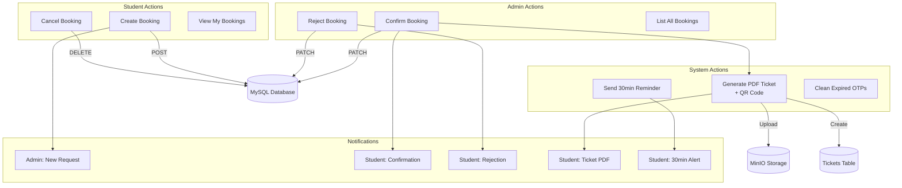
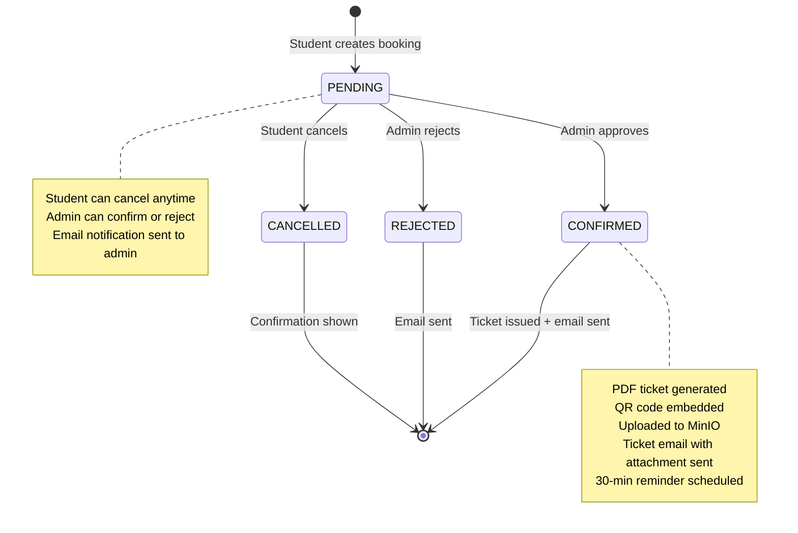

# Facility Booking System

## Overview

The Facility Booking System allows **students** to request booking of labs/ facilities, **admins** to confirm or reject requests, and the **system** to send automatic reminders and generate PDF tickets.

## Why This Module Exists

Students need lab space for project work, meetings, and research activities. Rather than manually coordinating with admin staff (paper forms, email requests), this system provides a structured digital workflow:

1. Students see available time slots and facilities
2. Admin has a single dashboard to manage all requests
3. Tickets and reminders reduce no-shows

## Real-World Analogy

Think of it like booking a hotel room:

- **Student** = Guest who wants to book
- **Booking request** = Reservation request
- **Admin** = Hotel manager who approves/rejects
- **Confirmed booking** = Confirmed reservation
- **Ticket** = Room key card (generated after confirmation)
- **Reminder** = Wake-up call 30 minutes before

## High-Level Architecture



## Complete File List

| File | Purpose |
|------|---------|
| `src/app/api/bookings/route.ts` | Create booking + guidance stub |
| `src/app/api/bookings/my/route.ts` | List user's bookings |
| `src/app/api/bookings/[id]/route.ts` | Cancel own booking |
| `src/app/api/admin/bookings/route.ts` | Admin list all bookings |
| `src/app/api/admin/bookings/[id]/confirm/route.ts` | Admin confirm + ticket |
| `src/app/api/admin/bookings/[id]/reject/route.ts` | Admin reject |
| `src/app/api/cron/reminder/route.ts` | 30-min reminder + OTP cleanup |
| `src/app/api/tickets/[ticketId]/download/route.ts` | Download ticket PDF |
| `src/app/api/tickets/verify/route.ts` | Verify + consume ticket |
| `src/app/facility-booking/page.tsx` | Student booking UI (870 lines) |
| `src/lib/tickets.ts` | PDF generation + ticket logic (873 lines) |
| `src/lib/time.ts` | `bookingDateTimeFromIST()` utility |
| `src/lib/mailer.ts` | Booking/ticket email templates |

## Request Flow: Creating a Booking

```
Browser (facility-booking/page.tsx)
│
│  User fills form: lab, date, timeSlot, facilities, purpose
│  handleSubmitBooking() called
│
├─► POST /api/bookings
│    │
│    ├─► Zod validation (purpose≥5, date valid, timeSlot not empty)
│    │
│    ├─► authenticate(req) — verify JWT from cookie
│    │
│    ├─► authorize(user, 'STUDENT', 'FACULTY')
│    │
│    ├─► Check: date not in past, date not >1 month away
│    │
│    ├─► prisma.booking.create({
│    │     data: { studentId, purpose, date, timeSlot, facilities, lab }
│    │   })
│    │   Status: PENDING
│    │
│    ├─► dispatchEmail to ADMIN_EMAIL
│    │   Subject: "New Facility Booking Request from {name}"
│    │   [best-effort — failures logged, never block response]
│    │
│    └─► Response: 201 { success, data: booking }
│
◄─── Response with booking reference
│
│  Client shows confirmation with booking details
│  trackEvent('booking_created', { lab, timeSlot })
```

## Database Models

### Booking (`bookings` table)

```prisma
model Booking {
  id           Int           @id @default(autoincrement())
  studentId    Int
  student      User          @relation(fields: [studentId], references: [id])
  purpose      String        @db.Text
  date         DateTime      // Midnight UTC
  timeSlot     String        // "09:00 - 11:00" (IST wall-clock)
  facilities   Json          // ["Projector", "Whiteboard"]
  lab          String        // "Research Culture Development Room 701"
  status       BookingStatus @default(PENDING)
  adminNote    String?       // Reason for rejection
  reminderSent Boolean       @default(false)
  ticket       Ticket?       // One ticket per booking
  createdAt    DateTime      @default(now())
  updatedAt    DateTime      @updatedAt
}
```

### Enums

```prisma
enum BookingStatus { PENDING, CONFIRMED, REJECTED, CANCELLED }
```

## State Machine



## Request Flow: Confirming a Booking (with Ticket)

```
Admin clicks "Confirm"
│
├─► PATCH /api/admin/bookings/[id]/confirm
│    │
│    ├─► authenticate(req) → verify JWT
│    ├─► authorize(user, 'ADMIN')
│    │
│    ├─► Find booking with student info
│    ├─► Guard: booking.status must be PENDING
│    │
│    ├─► Update: booking.status = 'CONFIRMED'
│    │
│    ├─► issueFacilityBookingTicket(booking.id)
│    │    │
│    │    ├─► Generate ticket ID: "BKG-YYYYMMDD-{20hex}"
│    │    ├─► Compute scheduledAt from date + timeSlot
│    │    ├─► Generate PDF with pdf-lib:
│    │    │   - A4 page, dark blue header
│    │    │   - "DIGITAL TICKET" label
│    │    │   - User name, booking details
│    │    │   - QR code with verification URL
│    │    ├─► Upload PDF to MinIO: tickets/YYYY/MM/{id}.pdf
│    │    ├─► Create Ticket record (status: ACTIVE)
│    │    ├─► Email PDF to student as attachment
│    │    └─► Log: TICKET_ISSUED
│    │
│    ├─► Send confirmation email (best-effort)
│    ├─► Log: BOOKING_CONFIRMED_WITH_TICKET
│    │
│    └─► Response: { success, data: { ticketId } }
```

## Email Notifications

| Trigger | To | Type | Function |
|---------|----|------|----------|
| Booking created | Admin | `ADMIN_BOOKING_REQUEST` | `dispatchEmail()` inline |
| Booking confirmed | Student | `BOOKING_CONFIRMED` | `sendBookingConfirmationEmail()` |
| Ticket issued | Student | `TICKET_ISSUED` | `sendTicketIssuedEmail()` (with PDF) |
| Booking rejected | Student | `BOOKING_REJECTED` | `sendBookingRejectionEmail()` |
| 30-min reminder | Student | `BOOKING_REMINDER` | `sendBookingReminderEmail()` |

## Key Code Snippets

### Date Validation (Create Booking)

```typescript
// Midnight UTC ensures date-only comparison
const dateObj = new Date(Date.UTC(year, month - 1, day));
const today = new Date(Date.UTC(today.getFullYear(), today.getMonth(), today.getDate()));

if (dateObj < today) {
  return errorRes('Date cannot be in the past.', [], 400);
}

const oneMonthFromNow = new Date(today);
oneMonthFromNow.setMonth(oneMonthFromNow.getMonth() + 1);
if (dateObj > oneMonthFromNow) {
  return errorRes('Date cannot be more than 1 month away.', [], 400);
}
```

### Ticket ID Generation

```typescript
const prefix = 'BKG';  // 'HKT' for hackathon tickets
const datePart = new Date().toISOString().slice(0, 10).replace(/-/g, '');
const randomHex = crypto.randomBytes(10).toString('hex').toUpperCase();
const ticketId = `${prefix}-${datePart}-${randomHex}`;
// Example: "BKG-20260727-A1B2C3D4E5F6A7B8C9D0"
```

### PDF Generation with QR Code

```typescript
const pdfDoc = await PDFDocument.create();
const page = pdfDoc.addPage([595.28, 841.89]);  // A4
const font = await pdfDoc.embedFont(StandardFonts.Helvetica);

// Draw header
page.drawRectangle({
  x: 0, y: 770, width: 595, height: 70,
  color: rgb(0, 0.13, 0.33),  // Dark blue
});

// Generate QR code as base64 PNG
const qrDataUrl = await QRCode.toDataURL(qrValue, {
  width: 240, margin: 2, errorCorrectionLevel: 'M'
});
const qrImage = await pdfDoc.embedPng(qrDataUrl);
page.drawImage(qrImage, { x: 50, y: 250, width: 120, height: 120 });
```

## Common Bugs

### 1. Timezone Confusion

**Problem**: `date` stored as midnight UTC, but `timeSlot` is IST wall-clock time. Combining them into a single `scheduledAt` is error-prone.

**Fix**: The `bookingDateTimeFromIST()` function handles this:
```typescript
// Takes midnight-UTC date and "09:00 - 11:00" timeSlot
// Returns: "2026-07-27T09:00:00+05:30" as a Date object
```

### 2. Ticket Email Fails After Confirm

**Problem**: If ticket generation or email fails, the booking is already CONFIRMED in the DB. The user sees "confirmed" but has no ticket.

**Fix**: The system logs `BOOKING_TICKET_ISSUE_FAILED` so admins can manually re-issue. The ticket generation has its own try/catch.

### 3. Cancelling Already-Cancelled Bookings

**Problem**: Student double-clicks cancel → two DELETE requests → second one sees status is already CANCELLED.

**Fix**: Guard `booking.status === 'PENDING'` prevents this.

## Debugging Guide

1. **Check booking exists**: `prisma.booking.findUnique({ where: { id } })` in database
2. **Check status transitions**: Booking must be `PENDING` to confirm/reject/cancel
3. **Check ticket**: Look in `tickets` table with `bookingId`
4. **Check MinIO**: PDF stored at `tickets/{year}/{month}/{ticketId}.pdf`
5. **Check logs**: `[ACTIVITY] BOOKING_*` events show lifecycle

## Exercises

1. **Add a new time slot**: Modify the time slots array in `src/app/facility-booking/page.tsx`
2. **Add admin note to confirmation**: Modify `src/app/api/admin/bookings/[id]/confirm/route.ts`
3. **Add a new booking status**: Add to `BookingStatus` enum, create migration, update all guards
4. **Customize ticket PDF**: Modify the PDF generation in `src/lib/tickets.ts`

## Summary

The booking system is a straightforward CRUD application with state machine, PDF generation, email notifications, and cron-driven reminders. It's an excellent module for beginners to start with because:
- Clear state transitions (PENDING → CONFIRMED/REJECTED/CANCELLED)
- Standard auth pattern (authenticate + authorize)
- Email integration (dispatchEmail)
- External service (MinIO for PDF storage)
- Background job (cron reminder)
