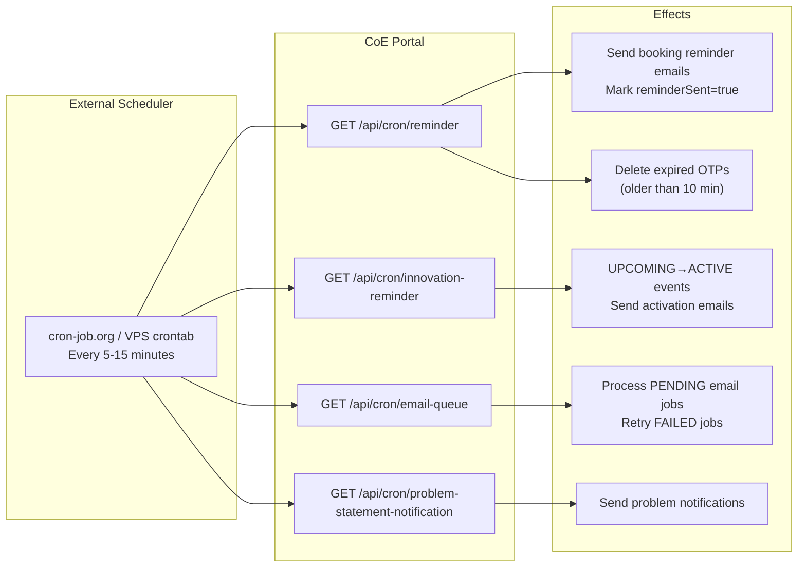

# Cron Jobs (Background Jobs)

## Overview

Cron jobs are scheduled background tasks that run at regular intervals. They are implemented as Next.js API route handlers that are triggered by an external scheduler.

## Why This Module Exists

Some tasks need to happen automatically without user interaction:
- Send booking reminders 30 minutes before a slot
- Activate hackathon events when their start time arrives
- Process the email queue
- Clean up expired OTP records

## Architecture



## Cron Jobs

### 1. Booking Reminder

**File: `src/app/api/cron/reminder/route.ts`**

**Purpose**: Send reminder emails for confirmed bookings starting within the next 30 minutes.

**Logic**:
```typescript
// 1. Find CONFIRMED bookings where reminderSent=false
// 2. For each, check if start time is in 0-30 min window
// 3. Send reminder email
// 4. Mark booking.reminderSent = true
// 5. Clean up OTPs older than 10 minutes
```

**Trigger**: Every 15 minutes

### 2. Innovation Reminder

**File: `src/app/api/cron/innovation-reminder/route.ts`**

**Purpose**: Manage hackathon event lifecycle transitions and notifications.

**Modes** (via query param `mode=`):
| Mode | Behavior |
|------|----------|
| `ALL` (default) | Runs all modes |
| `UPCOMING_ALL_STUDENTS` | Broadcast upcoming events to all active students |
| `ACTIVATE_REGISTERED` | Transition UPCOMING→ACTIVE events, notify registered teams |
| `ENDING_REMINDER` | Send ending reminders to registered teams |

**Filter by event**: `?eventId=12` scopes any mode to a single event.

**Logic**:
```typescript
// 1. Find events where status=UPCOMING and startTime <= now
// 2. Transition them to ACTIVE
// 3. Send activation emails to registered participants
// 4. Find events ending within threshold
// 5. Send ending reminder emails
```

### 3. Email Queue Worker

**File: `src/app/api/cron/email-queue/route.ts`**

**Purpose**: Process pending and retry email jobs from the `email_jobs` table.

**Logic**:
```typescript
// 1. Claim up to 50 PENDING or RETRY jobs (with lock)
// 2. For each job:
//    a. Try to send via SMTP
//    b. Success → mark SENT
//    c. Failure → increment attempts
//       - If maxAttempts reached → mark FAILED
//       - Otherwise → schedule next retry (status=RETRY)
```

### 4. Problem Statement Notification

**File: `src/app/api/cron/problem-statement-notification/route.ts`**

**Purpose**: Send notifications for new or updated problem statements.

**Logic**:
```typescript
// 1. Find APPROVED problems where notificationSent=false
// 2. Send sendNewProblemStatementEmail() to interested users
// 3. Mark problem.notificationSent = true
```

## Security

Cron endpoints are protected by **`CRON_SECRET` — which is OPTIONAL**. If `CRON_SECRET` is set, the caller must present it; if it is **not** set, the endpoint falls back to **standard ADMIN authentication** (`authenticate()` + `authorize(user, 'ADMIN')`). The secret is accepted via the `x-cron-secret` header **or** the `?secret=` query parameter:

```typescript
function isAuthorizedCron(req: NextRequest) {
  const expectedSecret = process.env.CRON_SECRET?.trim();
  const providedSecret = (req.headers.get('x-cron-secret') || req.nextUrl.searchParams.get('secret') || '').trim();

  if (expectedSecret) {
    return providedSecret === expectedSecret;
  }

  const user = authenticate(req);
  return Boolean(user && authorize(user, 'ADMIN'));
}
```

Failed checks return **403** (`Forbidden`). This means local/dev triggering works with an admin cookie even when `CRON_SECRET` is unset.

## Deployment

These endpoints must be called by an external scheduler:

| Service | How |
|---------|-----|
| **cron-job.org** (free) | Add HTTP job pointing to the URL |
| **VPS crontab** | `curl https://tcetcercd.in/api/cron/reminder?secret=...` |
| **Docker** | Use a sidecar container with curl |

**Important**: Vercel's serverless functions have a 10-second timeout. Cron jobs that process many items may exceed this. If self-hosting, the timeout is configurable.

## Common Bugs

### 1. Cron Jobs Not Running

**Problem**: Reminders not sent, emails stuck in PENDING.

**Fix**: Verify the external scheduler is configured and the cron secret matches.

### 2. Email Queue Overload

**Problem**: Hundreds of emails in PENDING status overwhelm the cron worker.

**Fix**: The worker processes batches of 50 (via `processEmailQueue(50)`). If you have thousands, it will take multiple cycles. Check `maxAttempts` and `priority` fields.

### 3. Booking Reminder Off by Hours

**Problem**: Reminders sent at wrong time because server and IST timezones differ.

**Fix**: The `bookingDateTimeFromIST()` function handles timezone conversion. Ensure the server's timezone is UTC.

## Exercises

1. **Add a new cron job**: Create a new route in `src/app/api/cron/`
2. **Add rate limiting**: Limit the number of emails sent per cron cycle
3. **Add cron job logging**: Track when each cron job ran and what it did
4. **Add manual trigger**: Create an admin UI button to trigger each cron job

## Summary

Cron jobs handle automated background tasks. They are standard Next.js route handlers protected by a shared secret. An external scheduler (cron-job.org, crontab) triggers them at regular intervals. The key cron jobs handle booking reminders, hackathon event transitions, email queue processing, and problem notifications.
