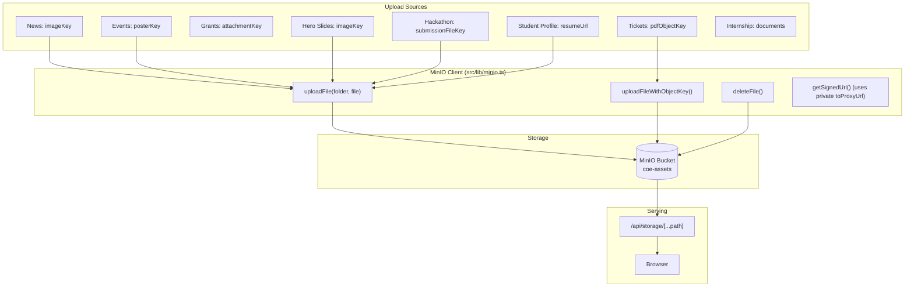

# File Storage (MinIO)

## Overview

The CoE Portal uses **MinIO**, an S3-compatible object storage server, for storing files and images. Files are served through a secure proxy endpoint instead of direct MinIO URLs.

## Why This Module Exists

The portal needs to handle file uploads:
- **Images**: News photos, event posters, hero slides, grant attachments
- **Documents**: Student resumes, hackathon PPTs, internship files
- **Generated PDFs**: Facility booking tickets, hackathon selection tickets

Using MinIO instead of the server's filesystem means:
- Files survive server restarts
- Storage can scale independently
- Multiple app instances can share the same files
- No database bloat from storing binary data

## Real-World Analogy

Think of MinIO as a **self-storage warehouse**:
- **Warehouse** = MinIO server
- **Storage unit** = Bucket (like `coe-assets`)
- **Box with label** = Object (file with a key/name)
- **Receipt** = The object key stored in the database
- **Delivery person** = The storage proxy (`/api/storage/[...path]`)

## Architecture



## Key Files

| File | Purpose |
|------|---------|
| `src/lib/minio.ts` | MinIO client, upload/download/delete functions |
| `src/app/api/storage/[...path]/route.ts` | Proxy endpoint that streams files from MinIO |

## MinIO Client

**File: `src/lib/minio.ts`** (93 lines)

### Configuration

```typescript
const minioClient = new Minio.Client({
  endPoint: process.env.MINIO_ENDPOINT || 'localhost',  // minio.example.com
  port: parseInt(process.env.MINIO_PORT || '9000'),
  useSSL: process.env.MINIO_USE_SSL === 'true',
  accessKey: process.env.MINIO_ACCESS_KEY || 'minioadmin',
  secretKey: process.env.MINIO_SECRET_KEY || 'minioadmin',
});

const BUCKET = process.env.MINIO_BUCKET || 'coe-assets';
```

The endpoint can be provided as a hostname (`minio.example.com`) or full URL (`https://minio.example.com`). The client auto-detects which format you're using.

### Key Functions

```typescript
// Upload a file with auto-generated key.
// NOTE: folder comes FIRST, and the file is a { buffer, originalname, mimetype, size } object.
export async function uploadFile(
  folder: string,  // e.g., "news", "hero-slides", "resumes"
  file: { buffer: Buffer; originalname: string; mimetype: string; size: number }
): Promise<string>  // Returns object key e.g., "news/1712345678-filename.jpg"

// Upload with a specific object key
export async function uploadFileWithObjectKey(
  objectKey: string,  // e.g., "tickets/2026/07/BKG-20260727-ABC123.pdf"
  file: { buffer: Buffer; originalname: string; mimetype: string; size: number }
): Promise<string>

// Delete a file
export async function deleteFile(objectKey: string): Promise<void>

// Get a pre-signed URL (expiry in seconds, default 3600)
export async function getSignedUrl(objectKey: string, expiry = 3600): Promise<string>

// Stream / stat an object (used by the storage proxy)
export async function getObjectStream(objectKey: string)
export async function getObjectStat(objectKey: string)
```

> `toProxyUrl()` exists in `src/lib/minio.ts` but is a **private helper** (not exported) — it is only used internally by `getSignedUrl()`. Frontends never call it; they either use the storage-proxy path directly or a URL returned by the API.

### Upload Flow

```typescript
// 1. Receive file from multipart form
const formData = await req.formData();
const file = formData.get('image') as File;
const buffer = Buffer.from(await file.arrayBuffer());

// 2. Upload to MinIO (folder first, then file metadata)
const objectKey = await uploadFile('news', {
  buffer,
  originalname: file.name,
  mimetype: file.type,
  size: file.size,
});

// 3. Store key in database
await prisma.newsPost.create({
  data: { imageKey: objectKey, title, caption }
});

// 4. Return the storage-proxy path (or a signed URL) to the frontend
return successRes({ imageUrl: `/api/storage/${objectKey}` });
```

### Storage Proxy

**File: `src/app/api/storage/[...path]/route.ts`**

Files are NOT served directly from MinIO. Instead, they go through a proxy that **enforces authentication and ownership**:

```typescript
const PUBLIC_PATH_PATTERNS = [
  /^hero-slides\//, /^news\//, /^events\//, /^grants\//,
  /^innovation\/events\/\d+\/[^/]+$/,          // public event notice PDFs
  /^innovation\/events\/\d+\/notice\//,
  /^innovation\/open-problems\/\d+\/support\//,
  /^innovation\/events\/\d+\/problems\/\d+\/support\//,
  /^innovation\/programs\//,                    // program notices (public by requirement)
];

export async function GET(req, { params }) {
  const objectKey = path.map(decodeURIComponent).join('/');

  // Public paths → stream directly
  // Everything else → authenticate(req) + canAccessObject(user, objectKey)
  //   - certificates/*        → only the certificate's owner (serial embeds userId)
  //   - tickets/{y}/{m}/{id}.pdf → only the ticket's owner
  //   - innovation/submissions|session-docs/{claimId}/* → only claim members
  //   - innovation/events/{eventId}/registration/* → claim members of that event
  //   - ADMIN/FACULTY bypass ownership checks
  //   - Unmapped paths → any authenticated user (legacy rule)
}
```

**Why a proxy?**
- The MinIO server might be on a private network (localhost)
- Browser security prevents fetching from unknown hosts
- The proxy keeps MinIO endpoint hidden from users
- Object keys are **deterministic** (they embed userIds, claimIds, ticketIds) — without ownership checks any authenticated user could harvest every team's decks, submissions, session documents and tickets. The proxy is **not open**: private objects return 401 (unauthenticated) / 403 (not the owner), and are served with `Cache-Control: private, no-store`.

### Folder Organization

```
coe-assets bucket/
├── news/              # News article images
│   └── {timestamp}-{filename}
├── events/            # Event posters
├── grants/            # Grant attachments
├── hero-slides/       # Homepage carousel images
├── resumes/           # Student/faculty resumes
├── tickets/           # Generated PDF tickets
│   └── {year}/{month}/{ticketId}.pdf
├── certificates/      # Certificate PDFs
│   └── {eventId}/{ACHIEVEMENT|PARTICIPATION}/{serial}.pdf
├── innovation/        # Hackathon PPT submissions, session docs,
│                      # event notices, open-problem support files, program files
├── hosting/           # Hosting request files
└── internship-documents/  # Internship workspace files
```

## Common Bugs

### 1. Mixed Content Errors

**Problem**: Page loaded over HTTPS but MinIO URLs are HTTP → browser blocks loading.

**Fix**: Always use the proxy endpoint (`/api/storage/...`) which runs on the app's domain. There is no `MINIO_USE_PROXY` switch — the proxy is the only serving path, and `MINIO_USE_SSL` controls whether the MinIO client itself talks TLS to the MinIO server.

### 2. Files Not Found After Upload

**Problem**: The object key is stored in DB but the file returns 404 from proxy.

**Fix**: Check that the object key in the database matches the actual path in MinIO. The `uploadFile()` function returns the exact key.

### 3. Uploaded File Has Wrong Content-Type

**Problem**: Browser displays raw bytes instead of rendering the image.

**Fix**: The proxy passes the content-type stored in MinIO object metadata (`stat.metaData['content-type']`), falling back to `application/octet-stream`. If MinIO detected the wrong MIME at upload time, the response type follows; re-upload the file with a correct MIME type.

## Exercises

1. **Upload to a new folder**: Add a new folder prefix and upload handler
2. **Add file size validation**: Check file size before uploading
3. **Add image resizing**: Use Sharp to resize images after upload
4. **Add file type validation**: Restrict uploads to specific MIME types

## Summary

MinIO provides S3-compatible object storage for all file uploads. Files are uploaded through the MinIO client, stored in the `coe-assets` bucket, and served through a proxy endpoint (`/api/storage/[...path]`). The proxy keeps the MinIO server address hidden from users and avoids mixed content issues.
