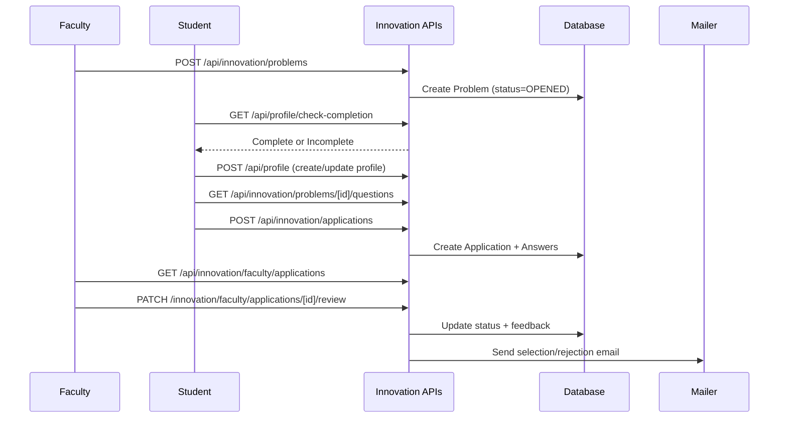
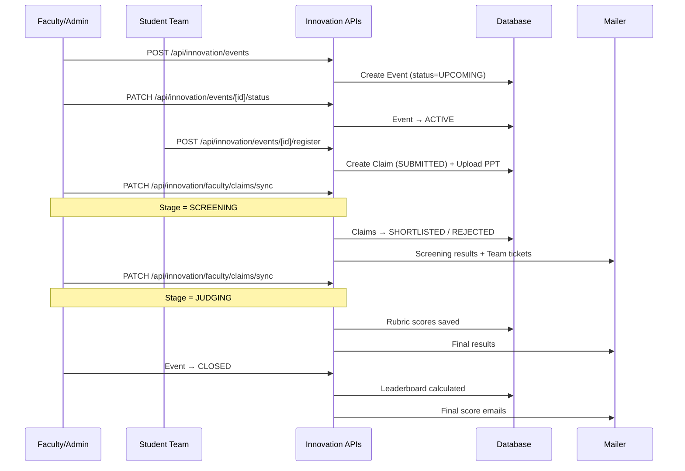
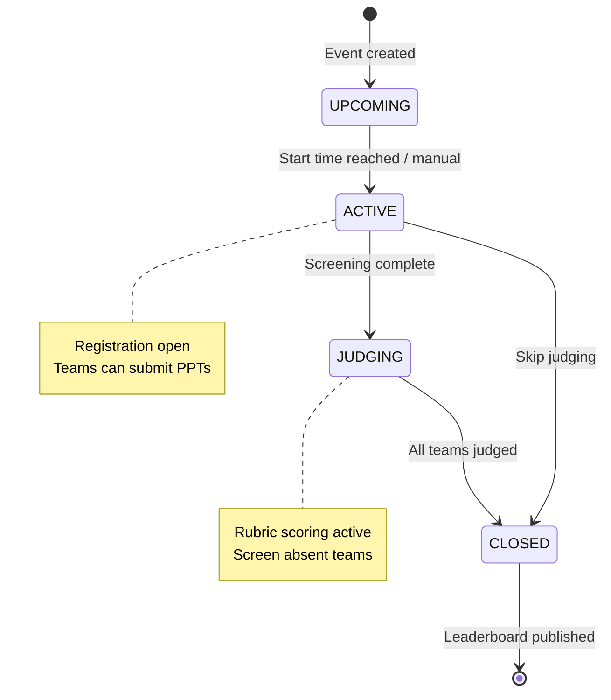
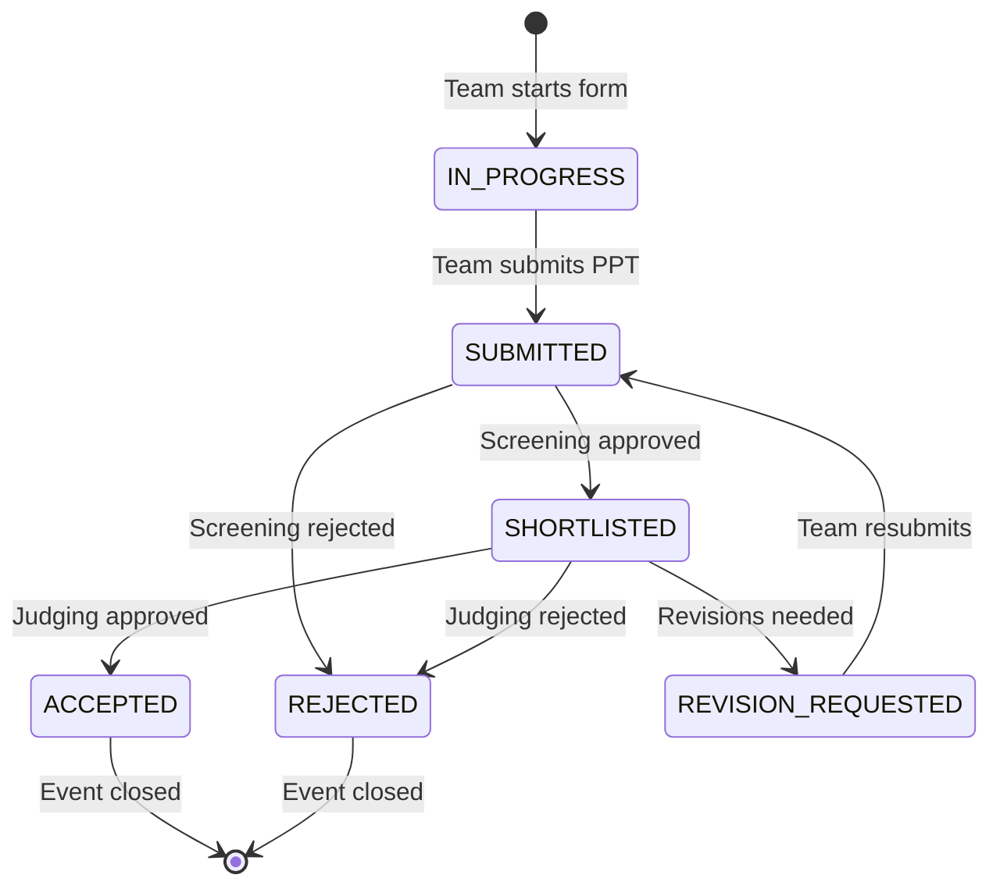

# Innovation Platform

## Overview

The Innovation Platform is the largest and most complex module in the CoE Portal. It manages:

1. **Hackathons** — Faculty create events with timelines; student teams register, submit PPTs, get screened, judged, scored, and receive certificates/tickets
2. **Open Problems** — [ARCHIVED] Faculty problem statements with student applications. Registration through the old flow was moved: `POST /api/innovation/claims` now returns a pointer to `/api/innovation/open-submissions` (the old open-statement registration path is archived; the `Application` flow remains in use for **internship** selections — see INTERNSHIP_SYSTEM.md)
3. **Innovation Programs** — program listings with student interest (`/api/innovation/programs/*`)
4. **Public Hackathon Vertical** — marketing/learning site under `/hackathons/*` (browse, external, learn, my, portfolio, dashboard, portal)

## Why This Module Exists

The Centre of Excellence runs innovation programs to encourage students to solve real-world problems. This platform digitizes the entire workflow:

- **Before**: Students emailed applications, faculty manually tracked them, hackathon judging was paper-based
- **After**: Structured submissions, rubric-based scoring, automated emails, leaderboards

## Real-World Analogy

**Open Problems** is like a job application portal:
- **Company** = Faculty (creates the job posting / problem)
- **Job posting** = Problem statement
- **Resume** = Student profile
- **Cover letter answers** = Problem-specific questions
- **HR** = Faculty reviewing applications

**Hackathons** is like a sports tournament:
- **Tournament organizer** = Faculty (creates the event)
- **Teams** = Student teams that register
- **Group stage** = PPT screening
- **Finals** = Final judging with rubric scores
- **Trophy** = Leaderboard position

## Architecture

```mermaid
graph TB
    subgraph "Open Problems Track"
        FP[Faculty creates Problem]
        SP[Student creates Profile]
        SQ[Student answers Questions]
        SA[Student submits Application]
        FR[Faculty reviews Application]
    end

    subgraph "Hackathon Track"
        FE[Faculty creates Event]
        TR[Team registers + Uploads PPT]
        SC[Screening: SHORTLISTED / REJECTED]
        JG[Judging: Rubric Scores]
        LB[Leaderboard published]
    end

    subgraph "Shared Components"
        AUTH["authenticate() + authorize()"]
        MAIL["Email Notifications"]
        STORE["File Uploads (MinIO)"]
        SCORE["Scoring Engine"]
        TICKET["Ticket Generation"]
    end

    FP --> AUTH
    SP --> AUTH
    SA --> AUTH
    SA --> MAIL
    FR --> MAIL
    FE --> AUTH
    TR --> STORE
    SC --> MAIL
    JG --> SCORE
    SC --> TICKET

    subgraph "Database"
        PROBLEM[(problems)]
        PROFILE[(student_profiles)]
        APP[(applications)]
        CLAIM[(claims)]
        EVENT[(hackathon_events)]
    end

    FP --> PROBLEM
    SP --> PROFILE
    SA --> APP
    FR --> APP
    TR --> CLAIM
    SC --> CLAIM
    JG --> CLAIM
    FE --> EVENT
    LB --> CLAIM
```



## Open Problems Workflow

> **ARCHIVED**: The open-statement registration flow below is kept for historical reference. `POST /api/innovation/claims` now rejects with `400` and a pointer to `/api/innovation/open-submissions`. The `Application`-based flow survives for **internship** problems (see INTERNSHIP_SYSTEM.md).



### Key Models

> Archived-track models. `Problem` also carries `approvalStatus`, `isIndustryProblem`/`industryName`, `industryId`, `difficulty`, `sdgTags`, `departmentId`, `supportDocumentKey`, `notificationSent`.

```prisma
model Problem {
  id          Int
  title       String
  description String
  mode        ProblemMode    // OPEN or CLOSED
  status      ProblemStatus  // OPENED, CLOSED, ARCHIVED
  problemType ProblemType    // OPEN, INTERNSHIP, FACULTY_INTERNSHIP
  createdById Int
  createdBy   User
  questions   ProblemQuestion[]
  applications Application[]
  claims      Claim[]
}

model StudentProfile {
  id         Int
  userId     Int      @unique
  user       User
  skills     String?
  experience String?
  interests  String?
  resumeUrl  String?
  isComplete Boolean  @default(false)
  applications Application[]
}

model Application {
  id        Int
  userId    Int
  user      User
  profileId Int?
  profile   StudentProfile?
  problemId Int
  problem   Problem
  status    ApplicationStatus  // SUBMITTED, SELECTED, REJECTED
  answers   ApplicationAnswer[]
  feedback  String?
}

model ApplicationAnswer {
  id            Int
  applicationId Int
  questionId    Int
  question      ProblemQuestion
  answerText    String
}

model ProblemQuestion {
  id          Int
  problemId   Int
  questionText String
  type        String @default("TEXT")
  answers     ApplicationAnswer[]
}
```

## Hackathon Workflow



### Key Models

```prisma
model HackathonEvent {
  id               Int
  title            String
  description      String?
  startTime        DateTime
  endTime          DateTime
  submissionLockAt DateTime?
  totalSessions    Int      @default(1)
  status           EventStatus  // UPCOMING, ACTIVE, JUDGING, CLOSED
  registrationOpen Boolean @default(true)
  createdById      Int
  createdBy        User
  pptFileKey       String?  // Event-level PPT template
  eventType        String   @default("hackathon")
  config           Json?    // { certificates: { issueOnAccept: boolean } }
  featured         Boolean  @default(false)
  problems         Problem[]
  rubrics          RubricCategory[]  // Config-driven rubric categories
  certificates     Certificate[]
}

model Claim {
  id                Int
  problemId         Int
  problem           Problem
  teamName          String?
  members           ClaimMember[]
  status            ClaimStatus  // IN_PROGRESS, SUBMITTED, SHORTLISTED, ACCEPTED, REJECTED, REVISION_REQUESTED
  submissionUrl     String?
  submissionFileKey String?
  // Rubric scores
  innovationScore   Int?
  technicalScore    Int?
  impactScore       Int?
  uxScore           Int?
  executionScore    Int?
  presentationScore Int?
  feasibilityScore  Int?
  finalScore        Int?
  score             Int
  feedback          String?
  badges            String?
  isAbsent          Boolean @default(false)
  reminderSent      Boolean @default(false)
  tickets           Ticket[]
  attendanceRecords TicketAttendance[]
  rubricScores      RubricScore[]
  sessionDocuments  SessionDocument[]
}

model ClaimMember {
  id      Int
  claimId Int
  userId  Int
  user    User
  role    String @default("MEMBER")
  attendanceRecords TicketAttendance[]

  @@unique([claimId, userId])
}

model Certificate {
  id           Int
  userId       Int
  eventId      Int
  type         String  // ACHIEVEMENT | PARTICIPATION
  title        String
  detail       String?
  fileKey      String? // MinIO: certificates/{eventId}/{TYPE}/{serial}.pdf
  serial       String  @unique  // CERT-<year>-<eventId>-<A|P><userId>
  issuedAt     DateTime @default(now())
  nameOverride String? // admin-corrected name on the PDF

  @@unique([userId, eventId, type])
}
```

## Certificate Engine

**Files: `src/lib/certificate-issuance.ts`, `src/lib/certificates.ts` (PDF rendering), `scripts/backfill-certificates.ts`**

Certificates are issued automatically when a hackathon event **closes** (and can be re-run/backfilled manually):

| Aspect | Behavior |
|--------|----------|
| **Serial** | `CERT-<year>-<eventId>-<A\|P><userId>` — deterministic, so re-runs are idempotent |
| **ACHIEVEMENT** | Top-3 teams by `finalScore` (config-respectable via `event.config.certificates.issueOnAccept`, **default true**) |
| **PARTICIPATION** | Every other member with **≥ 1 PRESENT** attendance row |
| **nameOverride** | Admin-corrected name shown on the PDF instead of `user.name` |
| **Storage** | MinIO keys `certificates/{eventId}/{TYPE}/{serial}.pdf` (served via the auth-gated storage proxy) |
| **Admin UI** | Innovation tab → **Certificates** tab in the admin panel (`/api/innovation/admin/certificates`) |
| **Student view** | `GET /api/innovation/certificates/my` |
| **Backfill** | `npm run certificates:backfill` — `npx tsx --env-file=.env scripts/backfill-certificates.ts [--reset] [eventId ...]`; no args = all CLOSED events; `--reset` deletes existing rows + PDFs **scoped to the events being re-run** |

## Scoring Engine

**File: `src/lib/hackathon-scoring.ts`**

```typescript
export const HACKATHON_RUBRIC_WEIGHTS = {
  innovation: 15,
  technical: 20,
  impact: 15,
  ux: 10,
  execution: 20,
  presentation: 10,
  feasibility: 10,
};

export const calculateWeightedHackathonScore = (scores: HackathonRubricScores): number => {
  return Math.round(
    scores.innovation + scores.technical + scores.impact +
    scores.ux + scores.execution + scores.presentation + scores.feasibility
  );
};
// Maximum possible: 100 points
```

Events can also define **config-driven rubric categories** (`RubricCategory`/`RubricScore` models) alongside the fixed seven-dimension rubric. Helpers in `src/lib/hackathon-scoring.ts` validate that rubric values stay within each category's max weight.

## Event Status State Machine



## Claim Status State Machine



## API Endpoints

| Endpoint | Method | Purpose | Auth |
|----------|--------|---------|------|
| `/api/innovation/problems` | GET | List problems | Public/Student |
| `/api/innovation/problems` | POST | Create problem | Faculty/Admin |
| `/api/innovation/problems/[id]` | PATCH | Update problem | Faculty/Admin |
| `/api/innovation/problems/[id]` | DELETE | Delete problem | Faculty/Admin |
| `/api/innovation/problems/[id]/questions` | GET/POST | Get / add problem questions | Authenticated |
| `/api/innovation/claims` | POST | Create claim — **returns pointer to `/api/innovation/open-submissions`** (open-statement registration archived) | Student |
| `/api/innovation/claims/my` | GET | My claims | Student |
| `/api/innovation/claims/[id]/submit` | PATCH | Submit claim (PPT upload) | Student |
| `/api/innovation/claims/[id]/session-documents` | GET/POST | Session documents | Student |
| `/api/innovation/events` | GET/POST | List / create events | Public / Faculty |
| `/api/innovation/events/[id]` | GET/PATCH | Event details / update | Public / Faculty |
| `/api/innovation/events/[id]/register` | POST | Register team | Student |
| `/api/innovation/events/[id]/leaderboard` | GET | Get leaderboard | Public (CLOSED only) |
| `/api/innovation/events/[id]/session-upload-locks` | GET/PATCH | Session upload locks | Faculty/Admin |
| `/api/innovation/interest` | POST/PATCH | Hackathon interest | Student |
| `/api/innovation/certificates/my` | GET | My certificates | Student |
| `/api/innovation/faculty/applications` | GET | List applications | Faculty/Admin |
| `/api/innovation/faculty/applications/[id]/review` | PATCH | Review application | Faculty/Admin |
| `/api/innovation/faculty/claims/sync` | PATCH | Screening/Judging sync — issues `HKT-` tickets on SHORTLISTED | Faculty/Admin |
| `/api/innovation/faculty/claims/[id]/review` | PATCH | Review claim — issues `HKT-` tickets on ACCEPTED | Faculty/Admin |
| `/api/innovation/faculty/claims/[id]/attendance` | PATCH | Mark claim attendance | Faculty/Admin |
| `/api/innovation/faculty/submissions` | GET | Faculty submissions | Faculty/Admin |
| `/api/innovation/admin/events/[id]/status` | PATCH | Change event status | Admin |
| `/api/innovation/admin/certificates` | GET/POST | List / issue certificates | Admin |
| `/api/innovation/admin/analytics/participants` | GET | Participants analytics | Admin |
| `/api/innovation/admin/analytics/teams` | GET | Teams analytics | Admin |
| `/api/innovation/admin/analytics/attendance` | GET | Attendance analytics | Admin |
| `/api/innovation/admin/analytics/insights` | GET | Insights analytics | Admin |
| `/api/innovation/admin/submissions` | GET | Admin submissions | Admin |
| `/api/innovation/admin/interests` | GET | Event interests | Admin |
| `/api/innovation/programs` | GET/POST | Innovation programs | Public / Faculty |
| `/api/innovation/programs/[id]` | GET/PATCH/DELETE | Program details/update/delete | Public / Faculty |
| `/api/innovation/programs/[id]/interest` | GET/POST/DELETE | Program interest | Student |
| `/api/innovation/users/lookup` | GET | User lookup by UID | Student |

## Hackathon Vertical (Public Pages)

The public hackathon site lives under `/hackathons` (`src/app/hackathons/`):

| Page | Purpose |
|------|---------|
| `/hackathons/browse` | Browse hackathon events |
| `/hackathons/external` | External hackathon opportunities |
| `/hackathons/learn` | Learning resources (backed by `LearningResource` model + `/api/learning-resources`) |
| `/hackathons/my` | My hackathons |
| `/hackathons/portfolio` | Innovation portfolio (`/api/profile/innovation-portfolio`) |
| `/hackathons/dashboard` | Student hackathon dashboard (`/api/hackathons/dashboard`) |
| `/hackathons/portal` | Portal view (route group `(portal)/hackathons/portal`) |
| `/hackathons/[id]` | Event detail |

Admin content management for this vertical lives at `/admin/hackathons-content` (learning resources + featured content) and `/admin/hackathons-config` (global hackathon configuration, `GET/PATCH /api/admin/hackathons-config`). The navbar **Programs** dropdown links to these vertical pages (desktop nav renders at `min-[1270px]`).

## Common Bugs

### 1. Profile Not Complete Error

**Problem**: Student tries to apply but gets "Complete your profile first". The check happens on the frontend before showing the apply button, but the API also checks server-side.

**Fix**: Create/update profile at `POST /api/profile` before applying.

### 2. Leaderboard Not Visible

**Problem**: Leaderboard endpoint returns empty or 404. The leaderboard is only available when event status is `CLOSED`.

**Fix**: Ensure the event status has been changed to `CLOSED` in the admin panel.

### 3. Judging Sync Fails

**Problem**: During JUDGING sync, rubric scores are required. If any rubric field is missing, the entire sync fails with validation error.

**Fix**: Ensure ALL rubric fields (innovation, technical, impact, ux, execution, presentation, feasibility) are provided. Absent teams (isAbsent=true) are skipped.

## Exercises

1. **Add a new rubric criterion**: Add field to Claim model, add to HACKATHON_RUBRIC_WEIGHTS
2. **Create a new problem type**: Extend ProblemType enum
3. **Add auto-scoring**: Calculate finalScore automatically based on rubric weights
4. **Add team size validation**: Modify the registration endpoint

## Summary

The Innovation Platform is the most feature-rich module with two tracks (open problems and hackathons), complex state machines, rubric-based scoring, ticket generation, and multi-stage email notifications. It demonstrates advanced Prisma queries, file uploads, state validation, and transactional operations.
