# Module Dependency Map

```mermaid
graph TB
    subgraph "Core"
        AUTH["Authentication"]
        JWT["JWT Service"]
        APIH["API Helpers<br/>authenticate + authorize"]
        VAL["Validators (Zod)"]
    end

    subgraph "User Features"
        REG["Registration"]
        PROF["User Profile"]
        LOGIN["Login"]
    end

    subgraph "Content"
        NEWS["News"]
        EVENTS["Events"]
        GRANTS["Grants"]
        ANNOUNCE["Announcements"]
        HERO["Hero Slides"]
    end

    subgraph "Facility"
        BOOK["Booking System"]
        TICKET["Ticket System"]
    end

    subgraph "Innovation"
        PROBLEM["Open Problems (archived)"]
        HACKATHON["Hackathons"]
        SCORE["Scoring Engine"]
        APP["Applications (internships)"]
        CERT["Certificate Engine"]
        HACKVERT["Hackathon Vertical (/hackathons/*)"]
        LEARN["Learning Resources"]
    end

    subgraph "Internship"
        INTERN["Internships"]
        WORKSPACE["Workspace<br/>Tasks/Chat/Meetings/Docs"]
    end

    subgraph "Admin"
        ADMIN["Admin Portal"]
        IMPERSONATE["Impersonation"]
        USERMGMT["User Management"]
    end

    subgraph "Infrastructure"
        EMAIL["Email System"]
        STORAGE["File Storage (MinIO)"]
        CRON["Cron Jobs"]
        SYNC["Dashboard Sync"]
        ACTIVITY["Activity Log"]
        ANALYTICS["Analytics (GA4)"]
    end

    subgraph "Project Dashboard [EXTERNAL — gitignored]"
        DASH_AUTH["Shared Auth"]
        DASH_PROJ["Project Management"]
        DASH_SHOW["Showcase"]
        DASH_EMAIL["Email Outbox"]
        DASH_BOUNCE["Bounce Detection"]
    end

    subgraph "External"
        DB[("MySQL Database")]
        MINIO[("MinIO Server")]
        SMTP[("SMTP (Gmail)")]
        GOOGLE[("Google OAuth")]
    end

    %% Core dependencies
    AUTH --> JWT
    AUTH --> APIH
    AUTH --> VAL
    AUTH --> DB
    LOGIN --> AUTH
    REG --> AUTH
    REG --> EMAIL

    %% Content depends on
    NEWS --> APIH
    NEWS --> STORAGE
    EVENTS --> APIH
    GRANTS --> APIH
    ANNOUNCE --> APIH
    HERO --> STORAGE

    %% Booking depends on
    BOOK --> APIH
    BOOK --> EMAIL
    BOOK --> TICKET
    BOOK --> DB
    BOOK --> ANALYTICS
    TICKET --> STORAGE
    TICKET --> EMAIL
    TICKET --> DB
    BOOK --> ACTIVITY

    %% Innovation depends on
    PROBLEM --> APIH
    PROBLEM --> DB
    HACKATHON --> APIH
    HACKATHON --> SCORE
    HACKATHON --> EMAIL
    HACKATHON --> TICKET
    HACKATHON --> CERT
    HACKATHON --> DB
    APP --> APIH
    APP --> DB
    APP --> EMAIL
    CERT --> STORAGE
    CERT --> DB
    HACKVERT --> HACKATHON
    HACKVERT --> LEARN
    LEARN --> DB
    LEARN --> STORAGE

    %% Internship depends on
    INTERN --> APIH
    INTERN --> DB
    WORKSPACE --> APIH
    WORKSPACE --> DB
    WORKSPACE --> STORAGE

    %% Admin depends on
    ADMIN --> APIH
    ADMIN --> DB
    ADMIN --> EMAIL
    ADMIN --> IMPERSONATE
    ADMIN --> USERMGMT
    IMPERSONATE --> JWT
    IMPERSONATE --> DB

    %% Infrastructure
    EMAIL --> SMTP
    STORAGE --> MINIO
    CRON --> EMAIL
    CRON --> DB
    CRON --> ACTIVITY
    SYNC --> DASH_AUTH

    %% Dashboard depends on
    DASH_AUTH --> AUTH
    DASH_PROJ --> DASH_AUTH
    DASH_SHOW --> DASH_AUTH
    DASH_SHOW --> STORAGE
    DASH_EMAIL --> SMTP
    DASH_BOUNCE --> SMTP

    %% Storage depends on
    STORAGE --> MINIO

    %% Activity logging
    ACTIVITY -->|console.log| LOG["Server Logs"]
```

## Dependency Table

| Module | Depends On | Used By |
|--------|-----------|---------|
| **Authentication** | JWT, API Helpers, Validators, Prisma | All modules |
| **JWT Service** | jsonwebtoken library | Auth, Refresh, API Helpers |
| **API Helpers** | JWT | Every protected route |
| **Email System** | SMTP (Nodemailer) | Booking, Innovation, Admin, Auth |
| **File Storage** | MinIO | News, Events, Hero, Tickets, Innovation, Internship |
| **Booking System** | Auth, Email, Tickets, MinIO | Admin Portal |
| **Ticket System** | pdf-lib, QRCode, MinIO, Email | Booking, Hackathon |
| **Innovation** | Auth, Email, Scoring, Tickets, Certificates, Storage | Admin, Faculty |
| **Scoring Engine** | None (pure math) | Innovation (Hackathon) |
| **Certificate Engine** | pdf-lib, MinIO, Prisma | Innovation (Hackathon) |
| **Hackathon Vertical** | Innovation, Learning Resources | Public |
| **Cron Jobs** | Email, Booking, Innovation, Prisma | External Scheduler |
| **Admin Portal** | All modules | — |
| **Dashboard Sync** | HTTP (fetch) | Auth, Admin (faculty approve) |
| **Project Dashboard** | External app (gitignored) — shared cookie only | CoE Portal (cookie) |
| **Activity Log** | console.log | All modules |
| **Analytics** | Google Analytics | Frontend pages |
