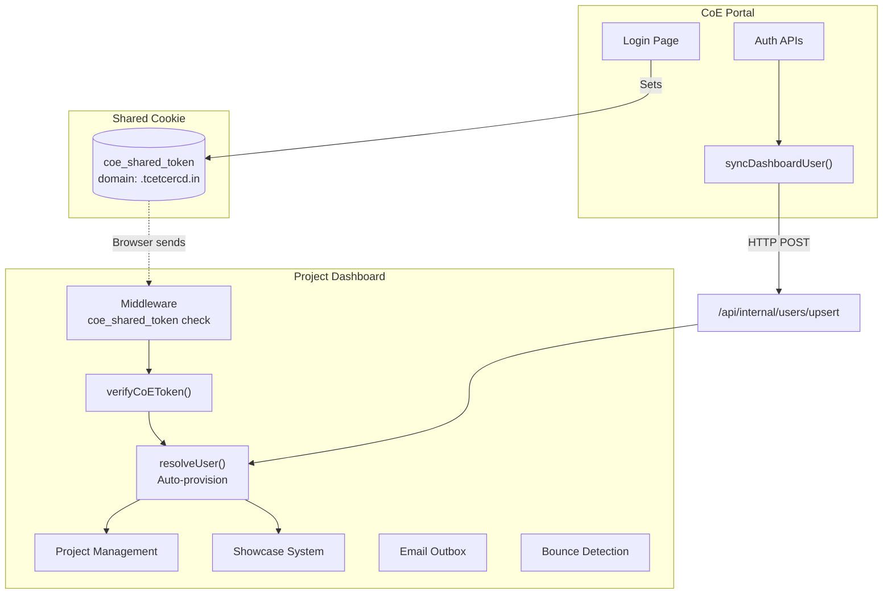

# Project Dashboard

> **⚠️ EXTERNAL APPLICATION**: The Project Dashboard lives in `project-dashboard/`, which is **gitignored and not part of this repository's source tree**. Everything below documents the integration contract and the app as it historically existed for context; it is not verifiable against this repo's code. The live source of truth is the dashboard's own repository.

## Overview

The Project Dashboard is a **separate Next.js application** that handles academic project management. It shares authentication with the CoE Portal through a cross-domain JWT cookie.

## Why This Module Exists

The CoE Portal handles content, bookings, and innovation. The Project Dashboard handles **academic project workflows** — tracking student projects, assignments, tasks, milestones, reviews, and publishing showcase projects.

They are separate applications because:
1. Different domain (project management vs portal features)
2. Independent databases and deployment
3. Different teams may maintain them
4. Shared authentication via SSO cookie, so users don't log in twice

## Location

All dashboard code lives in the external `project-dashboard/` directory (gitignored here — the CoE portal only integrates with it over HTTP via `src/lib/dashboard-sync.ts` and the shared cookie).

## Real-World Analogy

Think of the CoE Portal as the **college website** (news, events, bookings) and the Project Dashboard as the **LMS** (learning management system) — they're separate systems but you use the same login credentials.

## Architecture



## Shared Authentication Flow

### Step 1: User visits dashboard

```typescript
// project-dashboard/src/middleware.ts
export default async function middleware(req: NextRequest) {
  // 1. Check for coe_shared_token cookie
  const token = req.cookies.get("coe_shared_token")?.value;

  // 2. No token → redirect to CoE login
  if (!token) {
    const loginUrl = new URL("http://tcetcercd.in/login");
    loginUrl.searchParams.set("callbackUrl", req.nextUrl.href);
    return NextResponse.redirect(loginUrl);
  }

  // 3. Verify the JWT
  const payload = await verifyCoEToken(token);
  if (!payload || payload.status !== "ACTIVE") {
    return NextResponse.redirect(new URL("https://tcetcercd.in/login?reason=session_expired"));
  }

  // 4. Inject user info as headers for server components
  const requestHeaders = new Headers(req.headers);
  requestHeaders.set("x-coe-email", payload.email);
  requestHeaders.set("x-coe-name", payload.name || "");
  requestHeaders.set("x-coe-role", payload.role);
  requestHeaders.set("x-coe-status", payload.status);

  return NextResponse.next({ request: { headers: requestHeaders } });
}
```

### Step 2: Token verification

```typescript
// project-dashboard/src/lib/coe-auth.ts
export async function verifyCoEToken(token: string | null | undefined) {
  const secret = process.env.COE_JWT_SECRET;  // Must match JWT_ACCESS_SECRET
  const secretKey = new TextEncoder().encode(secret);
  const { payload } = await jwtVerify(token, secretKey);
  return { email, name, role, status };  // or null
}
```

### Step 3: User auto-provisioning

```typescript
// project-dashboard/src/lib/resolve-user.ts
export async function resolveUser(authUser: CoeAuthUser) {
  // 1. Check if user exists in dashboard DB
  // 2. If not, create user
  // 3. Check for PendingProjectAssignment records for this email
  // 4. Convert pending assignments to ProjectMember
  // 5. Create notifications for teachers and student
}
```

## Dashboard Modules

### 1. Project Management

The core feature: teachers create projects, add students, assign tasks and milestones, conduct reviews.

**Files in: `project-dashboard/src/app/(dashboard)/`**

Key pages:
- `/teacher/projects` — Teacher's project list
- `/teacher/projects/new` — Create new project
- `/teacher/projects/[id]` — Project details
- `/student/projects` — Student's projects
- `/student/projects/[id]` — Project view
- `/admin/projects` — Admin project control

### 2. Showcase System

A publishing platform for student projects with versioned submissions and admin review.

**Lifecycle**: `DRAFT → SUBMITTED → UNDER_REVIEW → (CHANGES_REQUESTED | APPROVED | REJECTED) → PUBLISHED`

**Files in: `project-dashboard/src/app/showcase/`**

Key pages:
- `/showcase` — Public project listing
- `/showcase/[projectId]` — Public project detail
- `/showcase/my-projects` — User's submissions

**Versioning**: Every submit/resubmit creates an immutable `ProjectVersion` snapshot. This ensures:
- Previous versions are preserved for audit
- Current edit state never overwrites historical submissions
- Admin can see what was submitted at each stage

### 3. Email Outbox

**File: `project-dashboard/src/lib/email-queue.ts`**

A database-backed email queue for sending notifications (project invitations, updates). Processed by a cron worker (`POST /api/cron/process-emails`).

### 4. Bounce Detection

**File: `project-dashboard/src/app/api/cron/detect-bounces/route.ts`**

Uses Gmail API to detect bounced invitation emails:

1. **BounceFetcher** — Queries Gmail for unread DSNs
2. **BounceParser** — Extracts recipient, diagnostic, Message-ID
3. **BounceValidator** — Checks if it's a permanent failure
4. **BounceMatcher** — Correlates to PendingProjectAssignment
5. **BounceProcessor** — Updates deliveryStatus to BOUNCED
6. **NotificationService** — Creates in-app notification for teacher

### 5. CSV Assignment Import

Admin can upload a CSV file with `email` and `projectName` columns to bulk-assign students to projects:

- Existing users: directly added as ProjectMember
- New users: stored as PendingProjectAssignment
- Email invitations are queued
- When new user registers (via CoE SSO), pending assignments auto-resolve

### 6. Public Explorers

- `/majorprojects` — Browse major projects
- `/rblprojects-te` — Browse TE RBL projects

## API Endpoints

> These live in the **external** dashboard app, not in this repo.

| Endpoint | Purpose |
|----------|---------|
| `POST /api/internal/users/upsert` | User sync from CoE (protected by SYNC_SECRET) |
| `POST /api/cron/process-emails` | Process email queue (protected) |
| `POST /api/cron/detect-bounces` | Run bounce detection (protected) |
| `POST /api/cron/send-task-reminders` | Send task reminders |
| `GET /api/storage/[...path]` | File proxy |
| `POST /api/upload` | File upload |
| `POST /api/files/presign` | Presigned upload URL |
| `POST /api/webhooks/chatwoot` | Chatwoot integration |

## Environment Variables

> Dashboard-side variables (external app). The CoE-side contract is `DASHBOARD_URL` + `SYNC_SECRET` in the portal's `.env`.

```env
COE_JWT_SECRET="<must-match-JWT_ACCESS_SECRET-from-CoE>"
COE_MAIN_URL="https://tcetcercd.in"
SYNC_SECRET="<shared-with-CoE>"
DASHBOARD_URL="https://project-dashboard.tcetcercd.in"
INSTITUTIONAL_EMAIL_DOMAIN="tcetmumbai.in"
EMAIL_QUEUE_CRON_SECRET="<secret>"
```

## Common Bugs

### 1. Users Not Appearing in Dashboard

**Problem**: User registers on CoE portal but doesn't appear in dashboard.

**Fix**: Check that `DASHBOARD_URL` and `SYNC_SECRET` are configured in CoE portal. Check the `syncDashboardUser()` call fires (look for `[dashboard-sync]` in logs).

### 2. coe_shared_token Not Working

**Problem**: Dashboard keeps redirecting to login even after logging in.

**Fix**: Check that `COE_JWT_SECRET` in dashboard matches `JWT_ACCESS_SECRET` in CoE portal. Check domain: both must be on `.tcetcercd.in` or `.localhost`.

### 3. Pending Assignments Not Resolving

**Problem**: Student invited via CSV registers but doesn't see the project.

**Fix**: The `resolveUser()` function checks `PendingProjectAssignment` by email. Ensure the email matches exactly (case-insensitive).

## Summary

The Project Dashboard is a substantial Next.js application that shares authentication with the CoE Portal via a cross-domain JWT cookie. It manages academic projects, showcase submissions, email outboxes, and bounce detection. Users are auto-provisioned on first visit via the SSO flow, and pending invitations are resolved automatically.
