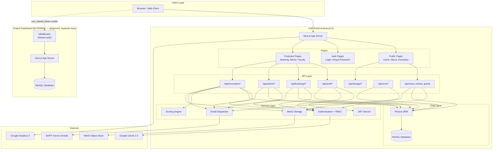
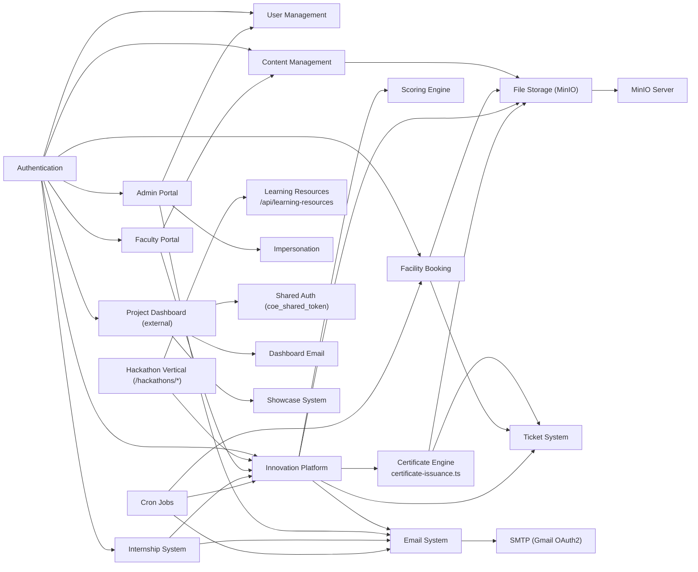
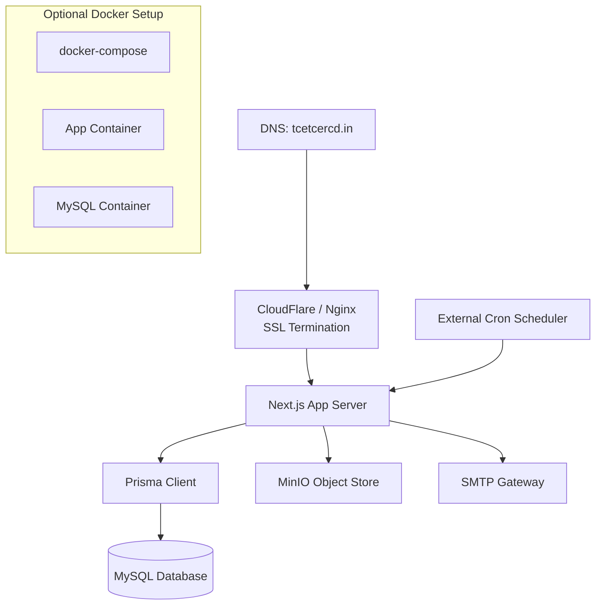
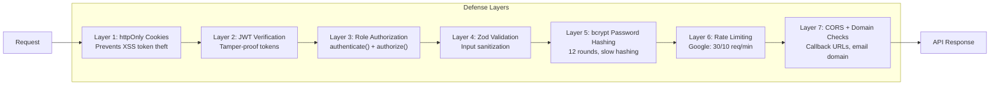

# System Architecture

## High-Level Architecture



## Request Flow (Typical Protected API)

```
Browser
  │
  ├─► Next.js App Router
  │     │
  │     ├─► Middleware (if applicable)
  │     │     └─► Check / set headers
  │     │
  │     ├─► Route Handler (/api/...)
  │     │     │
  │     │     ├─► Parse request body
  │     │     ├─► Zod validation
  │     │     ├─► authenticate() - verify JWT from cookie/bearer
  │     │     ├─► authorize() - check user role
  │     │     ├─► Business logic
  │     │     │     ├─► Prisma queries
  │     │     │     ├─► Email dispatch
  │     │     │     └─► Storage operations
  │     │     └─► Response { success, message, data }
  │     │
  │     └─► Server Component (for SSR pages)
  │           └─► Read cookies → authenticate → render
  │
  └─► Response to browser
```

## Module Dependency Map



## Module Categories

| Category | Modules |
|----------|---------|
| **Core Infrastructure** | Authentication, JWT, RBAC, API Helpers, Validators |
| **User Management** | Registration (Student/Faculty), Profile, Faculty Approval |
| **Content Management** | News, Events, Grants, Announcements, Hero Slides |
| **Facility Booking** | Booking CRUD, Admin Moderation, Ticket Generation, Reminders |
| **Innovation Platform** | Open Problems (archived), Hackathons, Screening/Judging, Scoring, Leaderboard, Certificates |
| **Hackathon Vertical** | Public pages: `/hackathons/browse`, `/external`, `/learn`, `/my`, `/portfolio`, `/dashboard`, `/portal` |
| **Internship System** | Industry Internships, Faculty Internships, Workspaces |
| **Admin Portal** | Stats, User Directory, Email Broadcast, Impersonation |
| **Faculty Portal** | Content Publishing, Application Review, Hackathon Judging |
| **Email System** | Queue-based Delivery, Templates, Cron Worker, Retry Logic |
| **File Storage** | MinIO Client, Upload, Auth-gated Proxy Serving |
| **Certificate Engine** | Achievement/Participation PDF certificates, serials, backfill script |
| **Learning Resources** | `/api/learning-resources` + `/hackathons/learn` + admin management in `/admin/hackathons-content` |
| **Background Jobs** | Booking Reminders, Innovation Reminders, Email Queue Processing, Problem-Statement Notifications |
| **Project Dashboard** | External app (gitignored): Shared Auth, Project Management, Showcase, Email Outbox |
| **Notifications** | In-App Notifications, Email Notifications |
| **Analytics** | Google Analytics 4 Event Tracking |

## Data Flow Patterns

### Pattern 1: Authenticated API Request
```
1. Browser sends request with httpOnly cookies
2. Route handler calls authenticate(req)
3. authenticate() reads accessToken from cookie
4. verifyAccessToken() decodes JWT
5. Route handler calls authorize(user, 'ROLE')
6. If authorized → business logic → response
7. If not → 401/403 error response
```

### Pattern 2: Email Dispatch
```
1. Business logic calls sendEmail() or dispatchEmail()
2. dispatchEmail() creates EmailJob record in database
3. For immediate mode: sends via SMTP immediately
4. For bulk mode: queued for cron worker
5. Cron worker (GET /api/cron/email-queue) processes pending jobs
6. Failed jobs are retried (up to maxAttempts)
```

### Pattern 3: File Upload
```
1. Client sends multipart/form-data with file
2. Route handler reads file, converts to Buffer
3. minio.uploadFile(folder, { buffer, originalname, mimetype, size }) uploads to MinIO bucket
4. Returns object key (path in bucket)
5. Object key stored in database
6. File served via /api/storage/[...path] proxy
   (public folders stream directly; private folders require auth + ownership)
```

### Pattern 4: Cross-App Sync
```
1. User verifies OTP or registers via Google on CoE portal
2. CoE portal calls syncDashboardUser() (fire-and-forget)
3. syncDashboardUser() POSTs to dashboard's internal API
4. Dashboard upserts user record
5. Dashboard resolves any pending project assignments
6. User can now access dashboard without separate login
```

## Environment Configuration

The application requires these environment variable groups:

| Group | Variables | Purpose |
|-------|-----------|---------|
| **Database** | `DATABASE_URL` | MySQL connection string |
| **JWT Auth** | `JWT_ACCESS_SECRET`, `JWT_REFRESH_SECRET`, `JWT_ACCESS_TTL_SECONDS`, `JWT_REFRESH_TTL_SECONDS` | Token signing + TTLs |
| **Google Auth** | `GOOGLE_CLIENT_ID`, `NEXT_PUBLIC_GOOGLE_CLIENT_ID`, `GOOGLE_REGISTRATION_SECRET`, `GOOGLE_SIGNIN_ENABLED`, `ALLOWED_EMAIL_DOMAIN` | OAuth |
| **Email** | `SMTP_HOST`, `SMTP_PORT`, `SMTP_USER`, `SMTP_PASS`, `SMTP_FROM`, `GOOGLE_CLIENT_SECRET`, `GOOGLE_REFRESH_TOKEN` | SMTP + OAuth2 |
| **Storage** | `MINIO_ENDPOINT`, `MINIO_PORT`, `MINIO_ACCESS_KEY`, `MINIO_SECRET_KEY`, `MINIO_USE_SSL`, `MINIO_BUCKET` | MinIO |
| **Analytics** | `NEXT_PUBLIC_GA_ID` | Google Analytics |
| **Cron** | `CRON_SECRET` (optional — falls back to ADMIN auth) | Cron job protection |
| **Dashboard Sync** | `DASHBOARD_URL`, `SYNC_SECRET` | Cross-app sync (external dashboard) |
| **Admin** | `ADMIN_EMAIL`, `ADMIN_PASSWORD`, `ADMIN_NAME` | Seed admin account |
| **Cookies/Other** | `COOKIE_SECURE`, `FRONTEND_URL`, `NEXT_PUBLIC_APP_URL`, `PRINCIPAL_EMAILS` | Cookie flags, app URLs, principal badge |

## Deployment Architecture



## Security Architecture


