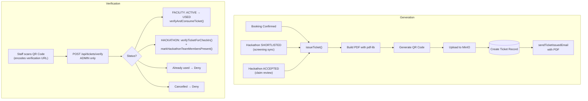

# Ticket System

## Overview

The Ticket System generates PDF tickets with QR codes for confirmed facility bookings and hackathon selection. Tickets are stored in MinIO and delivered via email.

## Why This Module Exists

Physical events need proof of booking/selection:
- **Facility booking**: Student shows the ticket at the lab entrance
- **Hackathon**: Teams get `HKT-` tickets **twice** — once when they are **SHORTLISTED** after PPT screening (issued by the screening sync), and again when they are **ACCEPTED** after judging (issued by the claim review route)

QR codes allow quick verification at entry.

## How Tickets Work



## Ticket ID Format

```typescript
// Facility booking tickets
const ticketId = `BKG-${datePart}-${randomHex.toUpperCase()}`;
// Example: BKG-20260727-A1B2C3D4E5F6A7B8C9D0

// Hackathon selection tickets
const ticketId = `HKT-${datePart}-${randomHex.toUpperCase()}`;
// Example: HKT-20260727-F1E2D3C4B5A69788796A5
```

The prefix is chosen by ticket type: `BKG` for `FACILITY_BOOKING`, `HKT` for `HACKATHON_SELECTION` (`getTicketPrefix()` in `src/lib/tickets.ts`). The random part is 20 uppercase hex characters (`crypto.randomBytes(10)`).

## Issuance Points

| Trigger | Endpoint / Function | Ticket type |
|---------|---------------------|-------------|
| Admin confirms a facility booking | `PATCH /api/admin/bookings/[id]/confirm` → `issueFacilityBookingTicket(bookingId)` | `BKG-` |
| Hackathon screening sync marks a claim SHORTLISTED | `PATCH /api/innovation/faculty/claims/sync` → `issueHackathonSelectionTicketsForClaim(claimId)` | `HKT-` |
| Hackathon judging review marks a claim ACCEPTED | `PATCH /api/innovation/faculty/claims/[id]/review` → `issueHackathonSelectionTicketsForClaim(claimId)` | `HKT-` |

The `@@unique([claimId, type])` constraint on `Ticket` guarantees at most one active `HKT-` ticket per claim per type, so re-running a sync cannot duplicate tickets.

## PDF Generation

**File: `src/lib/tickets.ts`** (873 lines)

Uses `pdf-lib` for PDF generation and `qrcode` for QR codes:

```typescript
const pdfDoc = await PDFDocument.create();
const page = pdfDoc.addPage([595.28, 841.89]);  // A4

// Dark blue header
page.drawRectangle({ x: 0, y: 770, width: 595, height: 70, color: rgb(0, 0.13, 0.33) });

// "DIGITAL TICKET" label
page.drawText("DIGITAL TICKET", { x: 50, y: 740, size: 14, color: rgb(0.97, 0.58, 0.11) });

// QR Code
const qrDataUrl = await QRCode.toDataURL(verificationUrl, { width: 240, margin: 2 });
const qrImage = await pdfDoc.embedPng(qrDataUrl);
page.drawImage(qrImage, { x: 50, y: 250, width: 120, height: 120 });
```

## Verification

The QR code embeds an **absolute verification URL** — `toAbsoluteUrl(getVerifyPath(ticketId))`, which points at the admin panel's ticket verification UI (`/admin?tab=operations&ops=tickets&ticketId=...`). The value is stored in `Ticket.qrValue` at creation time so it never changes.

```typescript
// POST /api/tickets/verify  — ADMIN ONLY (authorize(user, 'ADMIN'))
// Body: { ticketId, session?, presentClaimMemberIds? }

// For facility bookings:
await verifyAndConsumeTicket(ticketId, verifiedByUserId);
// Status: ACTIVE → USED

// For hackathon:
const info = await verifyTicketForCheckIn(ticketId, session);
await markHackathonTeamMembersPresent(ticketId, memberIds, userId, session);
```

- `verifyTicketForCheckIn()` is **admin-only** and is exposed exclusively through `POST /api/tickets/verify` (the route rejects non-ADMIN users with 403).
- Cancelling a ticket is **`PATCH /api/tickets/[ticketId]/cancel`** (not POST), owner-only.

## Database Models

### Ticket

```prisma
model Ticket {
  id            Int          @id @default(autoincrement())
  ticketId      String       @unique
  type          TicketType   // FACILITY_BOOKING or HACKATHON_SELECTION
  status        TicketStatus // ACTIVE, USED, CANCELLED
  userId        Int
  bookingId     Int?         @unique  // One ticket per booking
  claimId       Int?                   // Hackathon claim (HKT- tickets)
  title         String
  subjectName   String
  pdfObjectKey  String       // MinIO path
  qrValue       String       // Verification URL (absolute, embedded in QR)
  scheduledAt   DateTime?
  issuedAt      DateTime     @default(now())
  usedAt        DateTime?
  cancelledAt   DateTime?
  metadata      Json?
  attendanceRecords TicketAttendance[]

  @@unique([claimId, type])  // One HKT- ticket per claim per type
  @@map("tickets")
}
```

### TicketAttendance (Hackathon only)

```prisma
model TicketAttendance {
  id                Int
  ticketId          Int
  claimId           Int
  userId            Int
  claimMemberId     Int
  session           Int                    @default(1)
  status            MemberAttendanceStatus // NOT_PRESENT, PRESENT
  checkedInAt       DateTime?
  checkedInByUserId Int?                   // Admin who marked attendance
  checkedInBy       User?                  @relation("AttendanceMarker")

  @@unique([ticketId, claimMemberId, session])
  @@unique([userId, claimId, session])
  @@index([ticketId, session, status])
}
```

## Key Files

| File | Purpose |
|------|---------|
| `src/lib/tickets.ts` | Ticket generation, PDF, QR, verification logic |
| `src/app/api/tickets/verify/route.ts` | Verify + consume ticket (ADMIN only) |
| `src/app/api/tickets/my/route.ts` | List user's tickets |
| `src/app/api/tickets/[ticketId]/download/route.ts` | Download PDF |
| `src/app/api/tickets/[ticketId]/cancel/route.ts` | Cancel ticket (PATCH) |

## Common Bugs

### 1. PDF Generation Fails for Large Data

**Problem**: Too many team members cause the PDF to exceed memory limits.

**Fix**: The hackathon ticket shows team members in a table. If there are many members, the PDF layout may need adjustment.

### 2. QR Code URL Expired

**Problem**: The QR code points to a URL that changes (e.g., after deployment).

**Fix**: The QR value is stored in the database at ticket creation time (`Ticket.qrValue`). It is built once via `toAbsoluteUrl(getVerifyPath(ticketId))` and points to the admin verification screen — a stable app-domain URL, so it survives redeploys.

### 3. Duplicate Tickets

**Problem**: Double-click on confirm creates two tickets for the same booking.

**Fix**: The `bookingId` field has `@unique` constraint, preventing duplicate facility tickets. Hackathon tickets are protected by `@@unique([claimId, type])`. The `issueTicket()` function also checks for existing tickets before creating a new one.

## Exercises

1. **Change ticket design**: Modify colors, fonts, layout in `src/lib/tickets.ts`
2. **Add barcode**: Add a Code128 barcode alongside the QR code
3. **Add ticket expiry**: Auto-cancel tickets after the event date passes

## Summary

The Ticket System generates professionally formatted PDF tickets with QR codes for facility bookings and hackathon events. It uses pdf-lib for PDF generation, QRCode for QR codes, and MinIO for persistent storage. Tickets are emailed as attachments and verified at entry points.
